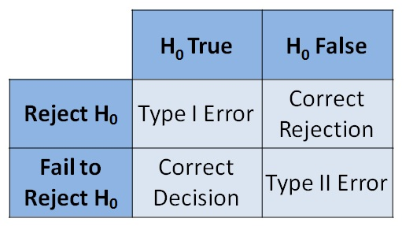

<!-- output: slidy_presentation -->


<!-- output: html_document: -->
<!--   toc: true -->
<!--   theme: united -->

<!-- output:  -->
<!--   revealjs::revealjs_presentation: -->
<!--     center: false -->


<!-- <link href="../styles.css" rel="stylesheet"> -->

## Quantifying Uncertainty

We want to deal with the uncertainty of our estimates and of unseen data points. We do this in two ways:

- hypothesis tests

- intervals (prediction intervals, confidence intervals, etc.)


## Hypothesis Testing!

We don't know $\beta_1$, we just have $\hat{\beta}_1$ (which is random)

<br/>

We have two hypotheses:
$$
H_0: \beta_1 = \beta_{1,0}
$$
and
$$
H_0: \beta_1 \neq \beta_{1,0}
$$

($\beta_{1,0}$ is usually $0$)

## Hypothesis Testing1

There is no guarantee!

```{r, le_plot, echo=FALSE, out.width = "800px"}

```


## Hypothesis Testing1

Two approaches:

- t-test

- F-test

(they are equivalent now, but they won't be when we use more than 1 predictor)

## The t-test

Our model:

\[
Y = \beta_0 +\beta_1 X + \epsilon
\]
<br/> 

- $\beta_0$ is the nonrandom, unknown intercept
- $\beta_1$ is the nonrandom, unknown slope
- $\epsilon$ has mean $0$
- $V[\epsilon \mid X] = \sigma^2$

Plus a new assumption:

- $\{\epsilon_i\}$ are independent and identically normally distributed


##  The t-test

We showed earlier:

- $E[\hat{\beta}_1 ] = \beta_1$

- $V[\hat{\beta}_1 ] = \sigma^2/S_{xx}$

With normality we get 
$$
\hat{\beta}_1 \sim \text{Normal}\left(\beta_1, \sigma^2/S_{xx} \right)
$$
or

$$
\frac{\hat{\beta}_1 - \beta_1}{\sqrt{\sigma^2/S_{xx}}  } \sim \text{Normal}\left(0, 1 \right)
$$


## The t-test

We can also show that
$$
\frac{\hat{\beta}_1 - \beta_1}{\sqrt{ MS_{Res}/S_{xx}}  } \sim t_{df_{Res}}
$$
(we still don't know $\beta_1$..)


## The t-test

If we assume *tentatively* that $H_0: \beta_1 = \beta_{1,0}$. This implies that 

$$
t_0 = \frac{\hat{\beta}_1 - \beta_{1,0}}{\sqrt{ MS_{Res}/S_{xx}}  }  \sim t_{df_{Res}}
$$


## The t-test

General idea: if we calculate $t_0$ but it doesn't look like it's coming from 

```{r tplot1, echo=TRUE, out.width = "500px"}
x <- seq(-3,3,.01)
alpha <- .05
plot(x,dt(x, 13), type = "l", xlab = "t0", ylab = "t density", main = "null distn")
abline(v=qt(alpha/2, 13),col="red")
abline(v=qt(1-alpha/2, 13),col="red")
```

then we reject our assumption about $\beta_1$ (we keep assuming all the other things, though)


## The t-test in `R`

```{r demo1, echo=TRUE}
setwd("/home/t/UVa/all_teaching/summer19_6021")
my_data <- read.csv("data/data-table-B3.csv")
reg_mod_1 <- lm(y ~ x1, data = my_data)
summary(reg_mod_1)  
```

## The F-test or Analysis of Variance


Goal: test to see if "anything is going on."

$$
SS_T = SS_R + SS_{Res}
$$

$$
df_T = df_R + df_{Res}
$$
or in this case
$$
n-1 = 1 + (n-2)
$$

Assuming $H_0: \beta_1 = 0$

$$
F_0 = \frac{ SS_R / df_R }{ SS_{Res}/df_{Res} } \sim F_{df_R, df_{Res}}
$$

If $\beta_1 \neq 0$ then $F_0$ should be larger!

## Analysis of Variance

Let's assume we have $22$ data points. Then $df_R = 1$ and $df_{Res} = 20$. If it's true that $H_0: \beta_1 = 0$ then this is the density of the random variable we're calculating:


```{r f_plot, echo=TRUE, out.width = "500px"}
x <- seq(0,10,.1)
y <- df(x, 1, 20)
cutoff <- qf(.95, df1 = 1, df2 = 20)
plot(x,y, type = "l", xlab = "F0", ylab = "F_{1,20} density", main = "null distn.")
abline(v=cutoff, col = "red")
```

## Analysis of Variance in `R` 

```{r demo3, echo=TRUE}
anova(reg_mod_1)  # analysis of variance = anova
```

## Intervals!

Now we discuss constructing intervals

- intervals for parameter estimates 

- intervals for "mean responses" $\hat{\beta}_0 + \hat{\beta}_1 x$

- intervals for unseen data $y_{new}$


## Intervals for parameter estimates 

Again, we assume normality of errors, in addition to all other assumptions.

Recall that 

$$
\frac{\hat{\beta}_1 - \beta_1}{\sqrt{ MS_{Res}/S_{xx}}  } \sim t_{df_{Res}}
$$

this is not a test here, so we do not assume anything about $\beta_1$

## Intervals for the slope

$$
P\left(-t_{\alpha/2, df_{Res} } \le \frac{\hat{\beta}_1 - \beta_1}{\sqrt{ MS_{Res}/S_{xx}}  } \le t_{\alpha/2, df_{Res} } \right) = 1-\alpha
$$
the left hand side is equivalent to
$$
P\left(\hat{\beta}_1 - t_{\alpha/2, df_{Res} } \sqrt{ MS_{Res}/S_{xx}} \le \beta_1 \le \hat{\beta}_1 + t_{\alpha/2, df_{Res} } \sqrt{ MS_{Res}/S_{xx}} \right) 
$$


## Intervals for the slope

So our interval is 
$$
\underbrace{\hat{\beta}_1}_{\text{point estimate}} \pm \overbrace{\underbrace{t_{\alpha/2, df_{Res} }}_{\text{multiplier}} \underbrace{\sqrt{ MS_{Res}/S_{xx}}}_{\text{standard error}}}^{\text{error}}
$$

```{r confint1, echo=TRUE, out.width = "500px"}
alpha <- .05
confint(reg_mod_1, level = 1-alpha)
```

## Intervals for $\sigma^2$

You can show that $SS_{Res}/\sigma^2 \sim \chi^2_{df_{Res}}$.


This means 

$$
P\left(\chi^2_{1-\alpha/2, df_{Res}} \le SS_{Res}/\sigma^2 \le \chi^2_{\alpha/2,df_{Res}} \right)
$$

if you rearrange this to look like  $\text{\left} \le \sigma^2 \le \text{\right}$ then your interval becomes

$$
\left[\frac{SS_{Res} }{\chi^2_{\alpha/2,df_{Res}} }, \frac{SS_{Res} }{\chi^2_{1-\alpha/2, df_{Res}} } \right]
$$

## Intervals for $\sigma^2$


I couldn't find a function for this, so we can do it manually

```{r confint2, echo=TRUE, out.width = "500px"}
alpha <- .05
dof <- nrow(my_data)-2
small_quantile <- qchisq(alpha/2, dof)
large_quantile <- qchisq(1-alpha/2, dof)
ssres <- sum(resid(reg_mod_1)^2)
cat("lower bound: ", ssres/large_quantile, 
    "\npoint estimate: ", ssres/dof, 
    "\nupper bound: ", ssres/small_quantile)
```


## Intervals for the mean response

We want an *expected* output for a hypothetical input $x_0$
$$
E[y \mid x_0] = \beta_0 + \beta_1 x_0
$$

All we have is the random "guess"

$$
\hat{E}[y \mid x_0] = \hat{\beta}_0 + \hat{\beta}_1 x_0
$$

Clearly it's unbiased, and normally distributed!

## Intervals for the mean response

Recall 


- $\hat{\beta}_0 = \bar{y} - \hat{\beta}_1 \bar{x}$

- $\hat{\beta}_1 = \sum_i c_i y_i$


so

\begin{align*}
\hat{E}[y \mid x_0] &= \hat{\beta}_0 + \hat{\beta}_1 x_0 \\
&= \bar{y} + \hat{\beta}_1\left(x_0 -  \bar{x}\right) \\
&= \sum_i \frac{y_i}{n}+ \sum_i c_i y_i\left(x_0 -  \bar{x}\right) \\
&= \sum_i y_i \left(\frac{1}{n} + c_i (x_0 -  \bar{x}) \right)
\end{align*}

## Intervals for the mean response


$$
\hat{E}[y \mid x_0] = \sum_i y_i \left(\frac{1}{n} + c_i (x_0 -  \bar{x}) \right)
$$

So 
\begin{align*}
V\left( \hat{E}[y \mid x_0] \right) 
&= \sum_i V\left[ y_i \left(\frac{1}{n} + c_i (x_0 -  \bar{x}) \right)\right] \tag{indep.} \\
&= \sum_i  \left(\frac{1}{n} + c_i (x_0 -  \bar{x}) \right)^2 V(y_i) \\
&= \sigma^2 \sum_i  \left(\frac{1}{n} + c_i (x_0 -  \bar{x}) \right)^2  \\
&= \sigma^2 \sum_i\left( \frac{1}{n^2} + 2 \frac{c_i}{n} (x_0 -  \bar{x})  + c_i^2 (x_0 -  \bar{x})^2 \right)^2 \\
&= \sigma^2 \left( \frac{1}{n} + \frac{(x_0 -  \bar{x})^2}{S_{xx}} \right) 
\end{align*}

because $\sum_i c_i = 0$

## Intervals for the mean response

Through a similar line of reasoning, you can make a "z-score" with an estimated standard error, and it will be t-distributed. This yields the following interval for the mean response:

$$
\hat{\beta}_0 + \hat{\beta}_1 x_0 \pm t_{\alpha/2, df_{Res}} \sqrt{ MS_{Res} \left( \frac{1}{n} + \frac{(x_0 -  \bar{x})^2}{S_{xx}} \right)  }
$$

in `R`:

```{r mrint, echo=TRUE}
#?predict.lm
new_df <- data.frame(x1=40) # common bug
predict(reg_mod_1, new_df, interval = "confidence") 
```


## Prediction intervals!

Now we want to predict $y_0$ based on $x_0$:
$$
y_0 = \beta_0 + \beta_1 x_0 + \epsilon
$$

And we have the same random "guess" based on $\{y_1, \ldots, y_n, x_1, \ldots, x_n\}$:

$$
\hat{y}_0 = \hat{\beta}_0 + \hat{\beta}_1 x_0
$$

To find a *prediction* interval, we need to look at the prediction error
$$
y_0 - \hat{y}_0 = (\beta_0 - \hat{\beta}_0) + (\beta_1  - \hat{\beta}_1)x_0 + \epsilon
$$
Clearly a mean zero normal variate.


## Prediction intervals

\begin{align*}
V\left[ y_0 - \hat{y}_0 \right] &= \text{Cov}\left(y_0 - \hat{y}_0, y_0 - \hat{y}_0 \right) \\
&= \text{Cov}\left[y_0 , y_0 \right] -2 \text{Cov}\left[y_0 ,  \hat{y}_0 \right] + \text{Cov}\left[\hat{y}_0,  \hat{y}_0 \right] \\
&= V[y_0] - 0 + V[\hat{y}_0] \\
&= \sigma^2 + \sigma^2 \left( \frac{1}{n} + \frac{(x_0 -  \bar{x})^2}{S_{xx}} \right)  \tag{previous}
\end{align*}


## Prediction intervals


A similar line of reasoning yields the following prediction interval:

$$
\hat{\beta}_0 + \hat{\beta}_1 x_0 \pm t_{\alpha/2, df_{Res}} \sqrt{ MS_{Res} \left(1 +  \frac{1}{n} + \frac{(x_0 -  \bar{x})^2}{S_{xx}} \right)  }
$$

in `R`:

```{r pred_int, echo=TRUE}
new_df <- data.frame(x1=40) 
predict(reg_mod_1, new_df, interval = "prediction") # interval arg changed
```


## Interval Comparison


```{r comparison, echo=F}
library(ggplot2)
#http://www.sthda.com/english/articles/40-regression-analysis/166-predict-in-r-model-predictions-and-confidence-intervals/
# 1. Add predictions at observed x data
suppressWarnings(pred.int <- predict(reg_mod_1, interval = "prediction"))
bigger_data <- cbind(my_data, pred.int)
# 2. Regression line + confidence intervals
library("ggplot2")
p <- ggplot(bigger_data, aes(x1, y)) +
  geom_point() +
  stat_smooth(method = lm)
# 3. Add prediction intervals
p + geom_line(aes(y = lwr), color = "red", linetype = "dashed")+
    geom_line(aes(y = upr), color = "red", linetype = "dashed")
```


blue is a CI for the mean response, red is the PI
