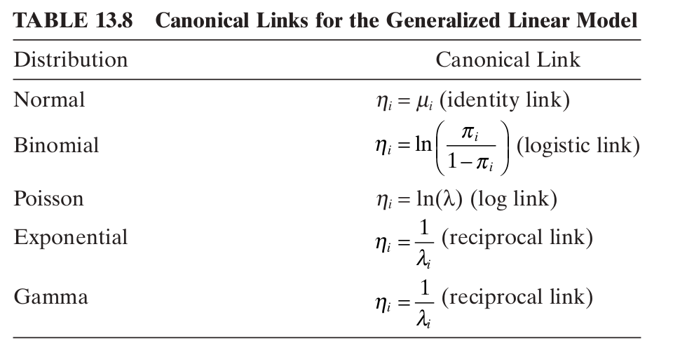

## More Than Two $y$ Outcomes 

Classification doesn't have to be for binary variables. E.g. blood type, genres of a movie, personality types of a human, topics of a tweet, etc.

It's relatively easy to extend logistic regression to classify $y_i$ that take on more than two values.


## Example 1

- $y_i \in \{0, 1, 2, \ldots, m\}$
- the label is **nominal** (no ordering)

Alternatively, you might consider a **one-hot** representation of each $y_i$. For example, instead of saying $y_i = 2$, you could say
$$
y_i = 
\underbrace{
\begin{bmatrix}
0 & 0 & 1 & \cdots & 0
\end{bmatrix}^\intercal}_{m+1 \text{ elements}}
$$

## Example 1

For this situation, we need to use the **softmax** function, which is analagous to a logistic sigmoid function. It maps a vector to another vector:
$$
\text{softmax} : \mathbb{R}^{m+1} \to [0,1]^{m+1}
$$

It is defined as

$$
\text{softmax}(\mathbf{z})
=
\begin{bmatrix}
\text{softmax}(\mathbf{z})_0 \\
\text{softmax}(\mathbf{z})_1 \\
\vdots \\
\text{softmax}(\mathbf{z})_m
\end{bmatrix}
= 
\begin{bmatrix}
\frac{\exp(z_0)}{\sum_{l=0}^{m}\exp(z_l)} \\
\frac{\exp(z_1)}{\sum_{l=0}^{m}\exp(z_l)}\\
\vdots \\
\frac{\exp(z_m)}{\sum_{l=0}^{m}\exp(z_l)}
\end{bmatrix}
$$

Notice that this vector sums to $1$, so it gives us probabilities for $m+1$ categories!


## Example 1

In **multinomial logistic regression**, you have each $\mathbf{x}_i \in \mathbb{R}^p$, but now you have more $p$-dimensional coefficient vectors because you have more categories.

Assume you have $\boldsymbol{\beta}^{(0)}, \boldsymbol{\beta}^{(1)}, \ldots, \boldsymbol{\beta}^{(m)}$. For each row $i$ you could take the softmax of $\begin{bmatrix}\mathbf{x}_i^\intercal \boldsymbol{\beta}^{(0)} & \mathbf{x}_i^\intercal \boldsymbol{\beta}^{(1)} & \cdots & \mathbf{x}_i^\intercal \boldsymbol{\beta}^{(m)} \end{bmatrix}^\intercal$ yielding

$$
\begin{bmatrix}
P(y_i = 0) \\
P(y_i = 1) \\
\vdots \\
P(y_i = m)
\end{bmatrix}
=
\begin{bmatrix}
\frac{\exp[\mathbf{x}_i^\intercal \boldsymbol{\beta}^{(0)}] }{ \sum_{k=0}^{m} \exp[\mathbf{x}_i^\intercal \boldsymbol{\beta}^{(k)}] } \\
\frac{\exp[\mathbf{x}_i^\intercal \boldsymbol{\beta}^{(1)}] }{ \sum_{k=0}^{m} \exp[\mathbf{x}_i^\intercal \boldsymbol{\beta}^{(k)}] } \\
\vdots \\
\frac{\exp[\mathbf{x}_i^\intercal \boldsymbol{\beta}^{(m)}] }{ \sum_{k=0}^{m} \exp[\mathbf{x}_i^\intercal \boldsymbol{\beta}^{(k)}] }
\end{bmatrix}.
$$

## Example 1

However, the likelihood is not **identifiable** because multiple parameter collections will give the same likelihood. For example, shifting all the coefficient vectors by the same vector $\mathbf{c}$ will produce the same likelihood. This can be seen if you multiply the numerator and denominator of each element of the vector by a constant $\exp[-\mathbf{x}_i^\intercal \mathbf{c}]$, nothing changes:

$$
\begin{bmatrix}
\frac{\exp[\mathbf{x}_i^\intercal \boldsymbol{\beta}^{(0)}] }{ \sum_{k=0}^{m} \exp[\mathbf{x}_i^\intercal \boldsymbol{\beta}^{(k)}] } \\
\frac{\exp[\mathbf{x}_i^\intercal \boldsymbol{\beta}^{(1)}] }{ \sum_{k=0}^{m} \exp[\mathbf{x}_i^\intercal \boldsymbol{\beta}^{(k)}] } \\
\vdots \\
\frac{\exp[\mathbf{x}_i^\intercal \boldsymbol{\beta}^{(m)}] }{ \sum_{k=0}^{m} \exp[\mathbf{x}_i^\intercal \boldsymbol{\beta}^{(k)}] }
\end{bmatrix}
=
\begin{bmatrix}
\frac{\exp[\mathbf{x}_i^\intercal (\boldsymbol{\beta}^{(0)}-\mathbf{c})] }{ \sum_{k=0}^{m} \exp[\mathbf{x}_i^\intercal (\boldsymbol{\beta}^{(k)}-\mathbf{c})] } \\
\frac{\exp[\mathbf{x}_i^\intercal (\boldsymbol{\beta}^{(1)}-\mathbf{c})] }{ \sum_{k=0}^{m} \exp[\mathbf{x}_i^\intercal (\boldsymbol{\beta}^{(k)}-\mathbf{c})] } \\
\vdots \\
\frac{\exp[\mathbf{x}_i^\intercal (\boldsymbol{\beta}^{(m)} - \mathbf{c})] }{ \sum_{k=0}^{m} \exp[\mathbf{x}_i^\intercal (\boldsymbol{\beta}^{(k)} -\mathbf{c}) ] }
\end{bmatrix}.
$$

## Example 1

The way to fix this is to constrain the parameters. Fixing one of them will lead to identifiability, because shifting all of them will no longer be permitted.

There are two common choices:

- set $\mathbf{c} = \hat{\boldsymbol{\beta}}^0$, which means $\boldsymbol{\beta}^0 = \mathbf{0}$ (we and the book will do this), and
- set $\mathbf{c} = \hat{\boldsymbol{\beta}}^{m}$, which means $\boldsymbol{\beta}^{m} = \mathbf{0}$.


## Example 1

So, here is the multinomial logistic regression model we will use:

$$
\begin{bmatrix}
P(y_i = 0) \\
P(y_i = 1) \\
\vdots \\
P(y_i = m)
\end{bmatrix}
=
\begin{bmatrix}
\frac{1}{1 + \sum_{k=1}^{m} \exp[\mathbf{x}_i^\intercal \boldsymbol{\beta}^{(k)}] } \\
\frac{\exp[\mathbf{x}_i^\intercal \boldsymbol{\beta}^{(1)}] }{ 1 + \sum_{k=1}^{m} \exp[\mathbf{x}_i^\intercal \boldsymbol{\beta}^{(k)}] } \\
\vdots \\
\frac{\exp[\mathbf{x}_i^\intercal \boldsymbol{\beta}^{(m)}] }{ 1 + \sum_{k=1}^{m} \exp[\mathbf{x}_i^\intercal \boldsymbol{\beta}^{(k)}] }
\end{bmatrix}.
$$
(note that we are summing from $k=1$ to $m$ now)
<!-- TODO: each $y_i$ is more than binomial(1, p)$ -->


## Example 1

Using category $0$ as a **baseline**, we can get logits (log-odds) using some simple algebra on the previous equation:

$$
\begin{bmatrix}
\log\left( \frac{ P(y_i = 1)}{P(y_i = 0) }\right) \\
\vdots \\
\log\left( \frac{P(y_i = m)}{P(y_i = 0) }\right)
\end{bmatrix}
=
\begin{bmatrix}
\mathbf{x}_i^\intercal \boldsymbol{\beta}^{(1)} \\
\vdots \\
\mathbf{x}_i^\intercal \boldsymbol{\beta}^{(m)}
\end{bmatrix}.
$$

## using `R`

First let's get some data and see what format it's in

```{r, echo=TRUE}
library(foreign) # for read.dta() to read in STATA files
library(nnet) # for multinom() 
ml <- read.dta("https://stats.idre.ucla.edu/stat/data/hsbdemo.dta")
head(ml, n = 3)
with(ml, table(prog)) #prog is our y variable
with(ml, summary(write)) # second x
```


## using `R`


```{r, echo=T}
ml$prog2 <- relevel(ml$prog, ref = "academic") #specify academic as baseline/0
myModel <- multinom(prog2 ~ write, data = ml)
summary(myModel) # the standard errors are Wald std errors
```

## Example 2

If our response $y_i \in \{0, 1, 2, \ldots, m\}$ is **ordinal** (think "order") then the order matters for the categories (e.g. low, medium, high blood pressure).

We can use **ordinal logistic regression** for this setup.


## Example 2

In the case of **ordinal logistic regression**, things change a little. Assume $\mathbf{x}_i$ doesn't have an intercept term. Each group will get it's own intercept:

$$
\begin{bmatrix}
P(y_i \le 0) \\
P(y_i \le 1) \\
\vdots \\
P(y_i \le m-1)
\end{bmatrix}
=
\text{invlogit}\left(
\begin{bmatrix}
\alpha_0 + \mathbf{x}_i^\intercal \boldsymbol{\beta}  \\
\alpha_1 + \mathbf{x}_i^\intercal \boldsymbol{\beta}  \\
\vdots \\
\alpha_{m-1} + \mathbf{x}_i^\intercal \boldsymbol{\beta} 
\end{bmatrix}
\right)
=
\begin{bmatrix}
\frac{\exp\left[ \alpha_0 + \mathbf{x}_i^\intercal \boldsymbol{\beta} \right]}{ 1 + \exp\left[ \alpha_0 + \mathbf{x}_i^\intercal \boldsymbol{\beta} \right] }  \\
\frac{\exp\left[ \alpha_1 + \mathbf{x}_i^\intercal \boldsymbol{\beta} \right]}{ 1 + \exp\left[ \alpha_1 + \mathbf{x}_i^\intercal \boldsymbol{\beta} \right]  }  \\
\vdots \\
\frac{\exp\left[ \alpha_{m-1} + \mathbf{x}_i^\intercal \boldsymbol{\beta} \right]}{ 1 + \exp\left[ \alpha_{m-1} + \mathbf{x}_i^\intercal \boldsymbol{\beta} \right]  } 
\end{bmatrix}
$$

## Example 2

A couple things to notice about 
$$
\begin{bmatrix}
P(y_i \le 0) \\
P(y_i \le 1) \\
\vdots \\
P(y_i \le m-1)
\end{bmatrix}
=
\text{invlogit}\left(
\begin{bmatrix}
\alpha_0 + \mathbf{x}_i^\intercal \boldsymbol{\beta}  \\
\alpha_1 + \mathbf{x}_i^\intercal \boldsymbol{\beta}  \\
\vdots \\
\alpha_{m-1} + \mathbf{x}_i^\intercal \boldsymbol{\beta} 
\end{bmatrix}
\right)
=
\begin{bmatrix}
\frac{\exp\left[ \alpha_0 + \mathbf{x}_i^\intercal \boldsymbol{\beta} \right]}{ 1 + \exp\left[ \alpha_0 + \mathbf{x}_i^\intercal \boldsymbol{\beta} \right] }  \\
\frac{\exp\left[ \alpha_1 + \mathbf{x}_i^\intercal \boldsymbol{\beta} \right]}{ 1 + \exp\left[ \alpha_1 + \mathbf{x}_i^\intercal \boldsymbol{\beta} \right]  }  \\
\vdots \\
\frac{\exp\left[ \alpha_{m-1} + \mathbf{x}_i^\intercal \boldsymbol{\beta} \right]}{ 1 + \exp\left[ \alpha_{m-1} + \mathbf{x}_i^\intercal \boldsymbol{\beta} \right]  } 
\end{bmatrix}
$$

- we are applying inverse logit elementwise, not the softmax function
- $P(y_i \le m)$ does not need to be estimated because it's $1$


## Example 2

Also notice that 
$$
\frac{\exp\left[ \alpha_k + \mathbf{x}_i^\intercal \boldsymbol{\beta} \right]}{ 1 + \exp\left[ \alpha_k + \mathbf{x}_i^\intercal \boldsymbol{\beta} \right] } = P(y_i \le k)  \le P(y_i \le k+1) = \frac{\exp\left[ \alpha_{k+1} + \mathbf{x}_i^\intercal \boldsymbol{\beta} \right]}{ 1 + \exp\left[ \alpha_{k+1} + \mathbf{x}_i^\intercal \boldsymbol{\beta} \right] }
$$
so
$$
 \alpha_k + \mathbf{x}_i^\intercal \boldsymbol{\beta}  \le \alpha_{k+1} + \mathbf{x}_i^\intercal \boldsymbol{\beta} 
$$
so
$$
\alpha_k \le \alpha_{k+1}.
$$

and that is why we restrict 
$$
\alpha_0 < \alpha_1 < \cdots < a_{m-1}.
$$


## Example 2

Also notice that $P(y_i \le k) = \frac{\exp\left[ \alpha_k + \mathbf{x}_i^\intercal \boldsymbol{\beta} \right]}{ 1 + \exp\left[ \alpha_k + \mathbf{x}_i^\intercal \boldsymbol{\beta} \right]  }$
implies
$$
1 - P(y_i \le k) = \frac{1}{ 1 + \exp\left[ \alpha_k + \mathbf{x}_i^\intercal \boldsymbol{\beta} \right]  }
$$
so
$$
\log \left( \frac{P(y_i \le k)}{1 - P(y_i \le k)} \right) = \alpha_k + \mathbf{x}_i^\intercal \boldsymbol{\beta}.
$$


## using `R`

First let's get some data


```{r}
carsdata <- read.csv("http://archive.ics.uci.edu/ml/machine-learning-databases/car/car.data",
                     header=F, # open the url in a web browser to see why we need this
                     stringsAsFactors=F)  # import string variables as characters not factors.
colnames(carsdata) <- c("buying", "maint", "doors", "persons", "lug_boot", "safety", "class")
head(carsdata)
```


## using `R`

a little data cleaning

```{r}
table(carsdata$class) # our ordinal y variable
carsdata$class <- factor(carsdata$class, levels=c("unacc", "acc", "good", "vgood"), ordered=TRUE) # order it better!
table(carsdata$class) # our ordinal y variable
```


## using `R`

```{r}
library(MASS) # for polr()
with(carsdata, table(lug_boot))
m <- polr(class ~ lug_boot, data = carsdata)
summary(m)
```

## using `R`

It looks like `polr()` gives you the negative of the coefficients:

```{r}
require(ggplot2, quietly = T)
ggplot(carsdata, aes(x = class, y = lug_boot)) +
  geom_jitter(alpha = .5) +
  theme(axis.text.x = element_text(angle = 45, hjust = 1, vjust = 1))
```


## Example 3

It's worth mentioning now that we can expand the original logistic regression model in another way. 

Originally, we assumed $y_i \sim \text{Binomial}(1, \pi_i)$. But it's also easy to work in situations where we assume each $y_i \sim \text{Binomial}(n_i, \pi_i)$. Most of the time $n_i = N$ for all $i$.

This isn't the same as multiple categories. This is just modeling an observation that is a **count**. For example, if we wanted to model the number of birdies for each golfer. This follows a $\text{Binomial}(18, \pi_i)$.

This changes the likelihood from $L(\mathbf{y} ; \mathbf{X}, \boldsymbol{\beta})  = \prod_{i=1}^n \pi_i^{y_i}(1-\pi_i)^{1-y_i}$ to

$$
L(\mathbf{y} ; \mathbf{X}, \boldsymbol{\beta})  = \prod_{i=1}^n {n_i \choose y_i} \pi_i^{y_i}(1-\pi_i)^{n_i-y_i}
$$

## Getting more general

Now we'll get a little more general. We will discuss **generalized linear models.**

We'll need to keep track of a bunch of greek letters, and they'll be relatively unfamiliar, but once you get past that it's not that bad...


## GLMs

Every type of regression model we will learn and many more are special case of GLMs. The normal regression model, logistic regression, Poisson regression, Exponential regression, Gamma regression are some examples.

The reason they can all be tied together is because the response's distribution is a particular example of an **exponential family** distribution. An exponential family distribution has the form 
$$
f(y_i \mid \theta_i, \phi) = \exp\left\{ [y_i \theta_i - b(\theta_i)]/a(\phi) + h(y_i, \phi) \right\}
$$
where

- $a(\phi)$ is a **scale** parameter 
- $\theta$ is a "natural" **location** parameter


## Exponential families example 1

Bernoulli distribution for logistic regression
$$
f(y_i \mid \theta_i, \phi) = \exp\left\{ [y_i \theta_i - b(\theta_i)]/a(\phi) + h(y_i, \phi) \right\}
$$

$$
\pi_i^{y_i}(1-\pi_i)^{1-y_i} = \exp\left[\log\left( \pi_i^{y_i}(1-\pi_i)^{1-y_i}\right) \right]
= \exp\left[y_i \underbrace{\log \left(\frac{\pi_i}{1-\pi_i} \right)}_{\theta_i} + \underbrace{\log (1 - \pi_i)}_{-b(\theta_i) }  \right]
$$
and 

- $a(\phi) = 1$
- $h(y_i, \phi) = 0$

## Exponential families example 2

$$
f(y_i \mid \theta_i, \phi) = \exp\left\{ [y_i \theta_i - b(\theta_i)]/a(\phi) + h(y_i, \phi) \right\}
$$

Poisson regression

$$
\frac{e^{-\lambda} \lambda^{y_i} }{y_i!} = \exp\left[ y_i \underbrace{\log \lambda}_{\theta_i } - \underbrace{\lambda}_{b(\theta_i)}  - \underbrace{\log(y_i!)}_{-h(y_i, \phi)} \right]
$$
again $a(\phi) = 1$.

## Exponential families example 3

$$
f(y_i \mid \theta_i, \phi) = \exp\left\{ [y_i \theta_i - b(\theta_i)]/a(\phi) + h(y_i, \phi) \right\}
$$

A normal distribution


\begin{align*}
(2\pi \sigma^2)^{-1/2}\exp\left[-\frac{1}{2\sigma^2}(y_i - \mu)^2 \right] &= \exp\left[-\frac{1}{2\sigma^2}(y_i^2 - 2y_i \mu + \mu^2) - \frac{1}{2}\log(2\pi \sigma^2)\right] \\
&= \exp\left[\frac{y_i  \mu}{\sigma^2} -\frac{\mu^2}{2\sigma^2}  -\frac{y_i^2}{2\sigma^2} - \frac{1}{2}\log(2\pi \sigma^2)\right] \\
&= \exp\left[\frac{y_i  \mu - \mu^2/2}{\sigma^2}  - \underbrace{\left( \frac{y_i^2}{2\sigma^2} +  \frac{1}{2}\log(2\pi \sigma^2) \right) }_{-h(y_i, \phi)} \right]
\end{align*}


## Exponential families example 4

$$
f(y_i \mid \theta_i, \phi) = \exp\left\{ [y_i \theta_i - b(\theta_i)]/a(\phi) + h(y_i, \phi) \right\}
$$

Gamma regression (Exponential is a special case)

\begin{align*}
&\frac{1}{\Gamma(\alpha)\beta^{\alpha}}y_i^{\alpha-1}\exp\left[-\frac{y_i}{\beta} \right] \\
&=
\exp\left[-\frac{y_i}{\beta} + (\alpha - 1)\log y_i - \log \Gamma(\alpha) - \alpha \log \beta \right] \\
&= \exp\left[ \frac{y_i\left( -1/\alpha \beta \right)}{1/\alpha} - \alpha \log \beta + (\alpha - 1)\log y_i - \log \Gamma(\alpha)  \right] \\
&= \exp\left[ \frac{y_i\left( -1/\alpha \beta \right)}{1/\alpha} + \alpha \log\left(\frac{\alpha}{\alpha\beta} \right) + (\alpha - 1)\log y_i - \log \Gamma(\alpha)  \right] \\
&= \exp\left[ \frac{y_i\left( -1/\alpha \beta \right) + \log\left( 1/(\alpha\beta) \right) }{1/\alpha}  + \underbrace{\alpha\log(\alpha) + (\alpha - 1)\log y_i - \log \Gamma(\alpha)}_{h(y_i, \theta)}  \right]
\end{align*}


## Cool properties

One set of cool properties is that you can find the means and variances by taking derivatives (easier than performing different integrations for each random variable!)

- $E[y_i] = \frac{d b(\theta_i)}{d\theta_i}$
- $V[y_i] = \frac{d^2 b(\theta_i)}{d\theta_i^2} a(\phi)$


## Example 1 revisited

For logistic regression, we found

$$
\pi_i^{y_i}(1-\pi_i)^{1-y_i} = \exp\left[\log\left( \pi_i^{y_i}(1-\pi_i)^{1-y_i}\right) \right]
= \exp\left[y_i \underbrace{\log \left(\frac{\pi_i}{1-\pi_i} \right)}_{\theta_i} + \underbrace{\log (1 - \pi_i)}_{-b(\theta_i) }  \right]
$$
and $a(\phi) = 1$. Checking the moments:

- $E[y_i] = \frac{d b(\theta_i)}{d\theta_i} = \pi_i$
- $V[y_i] = \frac{d^2 b(\theta_i)}{d\theta_i^2} a(\phi) = \pi_i(1-\pi_i)$

## Example 2 revisited

For the Poisson regression, we found

$$
\frac{e^{-\lambda} \lambda^{y_i} }{y_i!} = \exp\left[ y_i \underbrace{\log \lambda}_{\theta } - \underbrace{\lambda}_{b(\theta)}  - \underbrace{\log(y_i!)}_{-h(y_i, \phi)} \right]
$$
so

- $E[y_i] = \frac{d b(\theta_i)}{d\theta_i} = \lambda$
- $V[y_i] = \frac{d^2 b(\theta_i)}{d\theta_i^2} a(\phi) = \lambda$


## Example 3 revisited

For the regular normal regression, we found $\theta_i = \mu$, $b(\theta) = \mu^2/2$, $\alpha(\phi) = \sigma^2$, and

$$
\exp\left[\frac{y_i  \mu - \mu^2/2}{\sigma^2}  - \underbrace{\left( \frac{y_i^2}{2\sigma^2} +  \frac{1}{2}\log(2\pi \sigma^2) \right) }_{-h(y_i, \phi)} \right],
$$

so

- $E[y_i] = \frac{d b(\theta_i)}{d\theta_i} = \lambda$
- $V[y_i] = \frac{d^2 b(\theta_i)}{d\theta_i^2} a(\phi) = \lambda$


## Example 4 revisited

For the Gamma regression example, we found $\theta_i = -1/(\alpha\beta)$ and $a(\phi) = 1/\alpha$
$$
\exp\left[ \frac{y_i\left( -1/\alpha \beta \right) + \log\left( 1/(\alpha\beta) \right) }{1/\alpha}  + \underbrace{\alpha\log(\alpha) + (\alpha - 1)\log y_i - \log \Gamma(\alpha)}_{h(y_i, \theta)}  \right]
$$

so

- $E[y_i] = \frac{d b(\theta_i)}{d\theta_i} = \mu$
- $V[y_i] = \frac{d^2 b(\theta_i)}{d\theta_i^2} a(\phi) = \sigma^2$

## GLMs

Another cool thing about recognizing exponential families is that they tell you which link functions you should use to help squash your **linear predictor** $\mathbf{x}_i^\intercal \boldsymbol{\beta}$ or stretch your mean $E[y_i]$. 

## GLMs

In the logistic regression we used $\text{invlogit}$ to squash, and $\text{logit}$ to stretch.

We call any stretchy function a **link function**. The special link function suggested by the exponential family's $\theta_i$ parameter is called the **canonical link function**. Some other link functions are given on page 452.

```{r, echo=F, out.width = "300px"}

```

NB1: "logistic link" should be replaced with "logit link"

NB2: The canoninical link for the gamma rv is missing a negative sign, but it's more common to use this version (which is called the "inverse link")


## GLMs


More cool things about GLMs:

- estimated the same way (Maximum Likelihood)
- still have likelihood ratio test
- still have Wald tests and intervals (more on this now)


## GLMs

$\boldsymbol{\beta}$ is asymptotically normal and unbiased. The hard part is to find the covariance matrix. Same formula as before with logistic regression

$$
\text{V}\left[\boldsymbol{\beta} \right] = [-\mathbf{G}]^{-1}
$$
where $\mathbf{G}$ is the hessian, or matrix of second derivatives.

- you can have this calculated numerically (e.g. `vcov()` or a `hessian=TRUE` argument)
- derive it for general exponential families (we do that now)

## GLMs

First, the log-likelihood
$$
\ell(\boldsymbol{\beta}) = \sum_{i=1}^n \log f(y_i \mid \theta_i, \phi) = \sum_{i=1}^n  \frac{y_i \theta_i - b(\theta_i)}{a(\phi)} + h(y_i, \phi) 
$$

then the first derivative (with respect to beta!). Using the chain rule, we take with respect to $\theta$ first
$$
\sum_{i=1}^n  \frac{d}{d\theta}\frac{y_i \theta_i - b(\theta_i)}{a(\phi)} = \sum_{i=1}^n  \frac{y_i  - g^{-1}(\mathbf{x}_i^\intercal \boldsymbol{\beta})}{a(\phi)}
$$

and then with respect to the betas
$$
\nabla \ell(\boldsymbol{\beta}) = \frac{1}{a(\phi)}\sum_{i=1}^n  -\mathbf{x}_i [g^{-1}]^{'}(\mathbf{x}_i^\intercal \boldsymbol{\beta} )
$$

## GLMs

$$
\nabla \ell(\boldsymbol{\beta}) = \frac{1}{a(\phi)}\sum_{i=1}^n  -\mathbf{x}_i [g^{-1}]^{'}(\mathbf{x}_i^\intercal \boldsymbol{\beta} )
$$


and then another derivative

$$
\nabla^2 \ell(\boldsymbol{\beta}) = \frac{1}{a(\phi)}\sum_{i=1}^n  -\mathbf{x}_i\mathbf{x}_i^\intercal [g^{-1}]^{''}(\mathbf{x}_i^\intercal \boldsymbol{\beta} ) = - \frac{1}{a(\phi)} (\mathbf{X}^\intercal \mathbf{V} \mathbf{X} )
$$

so the variance is the negative of the inverse of this matrix above (as seen on page 455):
$$
\text{V}(\hat{\boldsymbol{\beta}}) = a(\phi) (\mathbf{X}^\intercal \mathbf{V} \mathbf{X} )^{-1}.
$$


## using `R`

All of the GLMs we've discussed can be estimated with the `R` function `glm()`. Just change the `family=` argument.

The syntax for how to fill in that argument can be found [here](https://stat.ethz.ch/R-manual/R-devel/library/stats/html/family.html).


## prediction!

Predictions are available after you have your parameter estimates. Just plug in a predictor vector $\mathbf{x}_0$

$$
\hat{y}_0 = g^{-1}(\mathbf{x}_0^\intercal \hat{\boldsymbol{\beta}} ).
$$

You can use the covariance matrix from before:
$$
\text{V}(g(\hat{y}_0)) = \text{V}(\mathbf{x}_0^\intercal\hat{\boldsymbol{\beta}}) = a(\phi) \mathbf{x}_0^\intercal(\mathbf{X}^\intercal \mathbf{V} \mathbf{X} )^{-1}\mathbf{x}_0
$$

## prediction!

$$
\text{V}(g(\hat{y}_0)) = \text{V}(\mathbf{x}_0^\intercal\hat{\boldsymbol{\beta}}) = a(\phi) \mathbf{x}_0^\intercal(\mathbf{X}^\intercal \mathbf{V} \mathbf{X} )^{-1}\mathbf{x}_0 
$$

Because
$$
-z_{\alpha/2} \le \frac{g(\hat{y}_0) - g(y_0) }{\sqrt{\text{V}(\mathbf{x}_0^\intercal\hat{\boldsymbol{\beta}})} } \le z_{\alpha/2}
$$
has probability $1-\alpha$, an interval for the mean response is 
$$
\left[ g^{-1}\left(\mathbf{x}_0^\intercal \hat{\boldsymbol{\beta}} - z_{\alpha/2}\sqrt{\text{V}(\mathbf{x}_0^\intercal\hat{\boldsymbol{\beta}})} \right) , g^{-1}\left(\mathbf{x}_0^\intercal \hat{\boldsymbol{\beta}} + z_{\alpha/2}\sqrt{\text{V}(\mathbf{x}_0^\intercal\hat{\boldsymbol{\beta}})} \right) \right]
$$


## using `R`

```{r, echo=F}
library(boot)
myDf <- read.csv("candy-data.csv")[,c(2,11)]
myDf[,2] <- logit(myDf[,2])
colnames(myDf)[2] <- "sugar_amount"
myDf <- myDf[order(myDf[,2]),]
```

`predict()` gave us fitted values last module, but it can also predict on new observations and calculate the standard errors $\sqrt{\text{V}(\mathbf{x}_0^\intercal\hat{\boldsymbol{\beta}})}$
```{r, out.width="300px"}
mod <- glm(chocolate ~ sugar_amount, family = binomial(link = "logit"), data = myDf)
myNewData <- data.frame(sugar_amount = c(4, 4.5))
predict(mod, type = "response", newdata = myNewData, se.fit = T)
```
