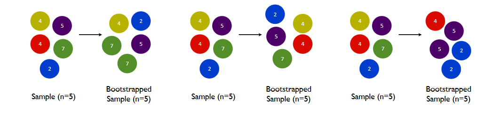

## Correlated Errors

Recall our regression model from a few modules ago:

$$
y_i = \mathbf{x}_i^\intercal \boldsymbol{\beta} + \epsilon_i
$$

and we assumed $\{\epsilon_i\}_{i}$ are i.i.d. normal.

Now we'll relax that assumption by assuming our errors are not independent!


## Correlated Errors

When would we need this? 

```{r, echo=F}
x <- seq(-10,30) 
y <- 3 - 2*x + 
  arima.sim(n = length(x), 
            list(ar = c(0.8897)),
            sd = 3)
```

```{r, out.width = "400px"}
plot(x,y)
abline(lm(y ~ x))
```


## Correlated Errors

When would we need this? 


```{r, out.width = "400px"}
plot(residuals(lm(y ~ x)), type ="b")
abline(h=0,col="red")
```


## Correlated Errors

If there's a missing regressor that you can find, that's probably the easiest way to fix this, but if not, you might want to stop assuming the errors are independent.

Beyond visually checking, we can formally test the hypothesis that the errors are correlated. Before we do that, we need some new tools.


## Correlated Errors

The process $\epsilon_1, \epsilon_2, \ldots$ is **stationary** if windows' distributions don't depend on where in time they are. 

In other words, 

$$
\epsilon_{3}, \epsilon_{5}, \ldots, \epsilon_{27}
$$
has the same joint distribution as
$$
\epsilon_{3+s}, \epsilon_{5+s}, \ldots, \epsilon_{27+s}
$$


## Correlated Errors

The process $\epsilon_1, \epsilon_2, \ldots$ is **stationary** if windows' distributions don't depend on where in time they are. 


So in particular, if you look at windows of length $1$ and $2$:
 
 - $E[\epsilon_t]$ is constant for all time points $t$
 - $V[\epsilon_t]$ is constant for all time points $t$
 - $\text{Corr}\left(\epsilon_1, \epsilon_{1+h} \right) = \text{Corr}\left(\epsilon_{1+s}, \epsilon_{1+h+s} \right)$ for any shift $s$ and lag $h$


## Correlated Errors

Correlation within a time series is usually referred to as **autocorrelation** ("auto" means self). 

If you take a [time series course](https://github.com/tbrown122387/stat_4170_slides), you'll learn about the **autocorrelation function** $\rho_{\epsilon} : \mathbb{Z} \to [-1,1]$

$$
\rho_{\epsilon}(h) = \text{Corr}\left(\epsilon_t, \epsilon_{t+h} \right) = \frac{\text{Corr}\left(\epsilon_t, \epsilon_{t+h} \right) }{\text{V}(\epsilon_t)}
$$
where $h$ is the "lag."

This definition only works for **stationary** processes. Where are the places where this is required?


## Correlated Errors


Every stationary time series has an autocorrelation function. The process that we will be using a lot is called an **autoregressive process** of order $1$:

\begin{gather}
\epsilon_t = \phi \epsilon_{t-1} + a_t \\
\epsilon_1 \sim N\left(0, \frac{\sigma^2_a}{1-\phi^2} \right)
\end{gather}
where $a_t$ are iid normal with mean $0$ and variance $\sigma^2_a$.


Notice that $-1 < \phi < 1$, otherwise the variance could be negative or infinite!


## Correlated Errors


\begin{gather}
\epsilon_t = \phi \epsilon_{t-1} + a_t \\
\epsilon_1 \sim N\left(0, \frac{\sigma^2_a}{1-\phi^2} \right)
\end{gather}

Notice that $\phi = 0$, then this simplifies to iid noise!


## Correlated Errors


\begin{gather}
\epsilon_t = \phi \epsilon_{t-1} + a_t \\
\epsilon_1 \sim N\left(0, \frac{\sigma^2_a}{1-\phi^2} \right)
\end{gather}

See how the mean and variance stay the same:

$$
\text{V}[\epsilon_2] = \text{V}[\phi \epsilon_{1} + a_2] = \phi^2\frac{\sigma^2_a}{1-\phi^2}  + \sigma^2_a = \frac{\sigma^2_a}{1-\phi^2} = \text{V}[\epsilon_1]
$$

We use $\text{V}[\epsilon_t] = \frac{\sigma^2_a}{1-\phi^2}$ in the next slide...


## Correlated Errors

\begin{gather}
\epsilon_t = \phi \epsilon_{t-1} + a_t \\
\epsilon_1 \sim N\left(0, \frac{\sigma^2_a}{1-\phi^2} \right)
\end{gather}

Now we find the autocorrelations. It's easier to start off with **autocovariances** so we can use **bilinearity**

$$
\text{Cov}[\epsilon_{t-1}, \epsilon_{t}] = \text{Cov}[\epsilon_{t-1},\phi \epsilon_{t-1} + a_t] =  \phi \text{Cov}[\epsilon_{t-1}, \epsilon_{t-1}] = \phi \text{V}[\epsilon_t] 
$$

So 
$$
\rho_{\epsilon}(1) = \text{Corr}\left(\epsilon_{t-1}, \epsilon_{t} \right) = \phi
$$


## Correlated Errors

At higher lags:

\begin{align*}
\text{Cov}[\epsilon_{t-2}, \epsilon_{t}] &= \text{Cov}[\epsilon_{t-2},\phi \epsilon_{t-1} + a_t] \\
&= \text{Cov}[\epsilon_{t-2},\phi \epsilon_{t-1}] \\
&= \text{Cov}[\epsilon_{t-2},\phi^2 \epsilon_{t-2} + \phi a_{t-1}] \\
&= \phi^2 \text{V}[\epsilon_t] 
\end{align*}

So 
$$
\rho_{\epsilon}(2) = \text{Corr}\left(\epsilon_{t-2}, \epsilon_{t} \right) = \phi^2
$$

Proceeding inductively: $\rho_{\epsilon}(h) = \phi^h$.


## A Hypothesis Test

The **Durbin-Watson test** tests
$$
H_0: \phi = 0
$$
against
$$
H_A: 1 > \phi > 0.
$$

The test statistic it uses is 
$$
d = \frac{\sum_{t=2}^T(e_t - e_{t-1})^2}{\sum_{t=1}^T e_t^2}
$$
where $T$ is the sample size, and $e_t$ are the residuals obtained after fitting a regular OLS regression.

## A Hypothesis Test


$$
d = \frac{\sum_{t=2}^T(e_t - e_{t-1})^2}{\sum_{t=1}^T e_t^2}
$$

Reject when this is low!

```{r, echo=F, out.width = "600px"}

```


## using `R`

`R`'s `dwtest()` has an involved algorithm for finding the p-values called "Pan's algorithm"

```{r, echo=F}
suppressMessages(library(lmtest))
```


```{r}
dwtest(lm(y ~ x), alternative = "greater") # need library(lmtest)
```


## Estimating the model with MLE

Say we have identified the problem, and now we must fit the following model:


\begin{gather}
y_i = \mathbf{x}_i^\intercal \boldsymbol{\beta} + \epsilon_i \\
\epsilon_t = \phi \epsilon_{t-1} + a_t \\
\epsilon_1 \sim N\left(0, \frac{\sigma^2_a}{1-\phi^2} \right)
\end{gather}

The book mentions the Cochrane-Orchutt procedure, but MLE is better.


## Estimating the model with MLE

Recall our original OLS model from module 3 

$$
\mathbf{y} \sim \text{Normal}\left(\mathbf{X} \boldsymbol{\beta}, \sigma^2 \mathbf{I}_n \right)
$$
which is the same as 
$$
f(\mathbf{y} \mid \mathbf{X}, \boldsymbol{\beta}, \sigma^2) = (2\pi)^{-n/2}\det[\sigma^2 \mathbf{I}_n]^{-1/2}\exp\left[-\frac{1}{2 }(\mathbf{y} - \mathbf{X} \boldsymbol{\beta})^{\intercal} \left[\sigma^2 \mathbf{I}_n \right]^{-1} (\mathbf{y} - \mathbf{X} \boldsymbol{\beta}) \right]
$$

The only thing different now, when we have correlated errors, is the covariance matrix. 

We must replace $\sigma^2 \mathbf{I}_n$ with a $\boldsymbol{\Gamma}$.

## Estimating the model with MLE


To find $\boldsymbol{\Gamma}$, we can just use the autocovariances we found before. Recall

$$
\text{Cov}[\epsilon_{t}, \epsilon_{t+h}] =  \phi^h \text{V}[\epsilon_t] = \phi^h \frac{\sigma^2_a}{1-\phi^2}.
$$

So 
$$
\boldsymbol{\Gamma}
=
\frac{\sigma^2_a}{1-\phi^2}
\begin{bmatrix}
1 & \phi^1 & \phi^2 & \cdots & \phi^{n-1} \\
\phi^1 & 1 & \phi^1 & \cdots & \phi^{n-2} \\
\vdots & \vdots & \ddots & \vdots  & \vdots\\
\phi^{n-2} & \cdots & \cdots & \cdots & \phi^{1} \\
\phi^{n-1} & \cdots & \cdots & \phi^1 & 1 \\
\end{bmatrix}
$$

matrices with this banded pattern are called "Toeplitz matrices"

## Estimating the model with MLE


So we have our likelihood that we can maximize with any numerical scheme:

$$
f(\mathbf{y} \mid \mathbf{X}, \boldsymbol{\beta}, \boldsymbol{\Gamma}) = (2\pi)^{-n/2}\det[\boldsymbol{\Gamma}]^{-1/2}\exp\left[-\frac{1}{2 }(\mathbf{y} - \mathbf{X} \boldsymbol{\beta})^{\intercal} \boldsymbol{\Gamma} ^{-1} (\mathbf{y} - \mathbf{X} \boldsymbol{\beta}) \right]
$$

Beware: it is very easy to poorly program a function to evaluate this. $\boldsymbol{\Gamma}$ is $n \times n$...naively inverting that on a large data set could be **very slow**.


## using `R`

```{r, out.width="400px"}
# don't change order= 
# because we haven't 
# discussed any other 
# time series models
corrErrorMod <- 
  arima(x=y, #dependent variable has a confusing name
        xreg=x, #independent variable
        include.mean = T,
        method="ML",
        order=c(1,0,0))
plot(residuals(corrErrorMod)) #these look better
```


## using `R`

```{r}
summary(corrErrorMod)
corrErrorMod$coef # phi, beta0, beta1
summary(lm(y ~ x)) # estimates are pretty close to simple ols model
```


## The Bootstrap

And now for something totally different: **the bootstrap**, which is a class of computationally-intensive techniques to find confidence or prediction intervals, or perform hypothesis tests. 


## The Bootstrap

"Bootstrap" is a pretty vague word that can refer to probably hundreds of different procedures, but what they all have in common is that they **sample with replacement** $m$ times from the existing data set. 

```{r, echo=F, out.width="700px"}

```

[img source](https://stats.stackexchange.com/questions/246726/size-of-bootstrap-samples/246734)


## The Bootstrap

This approximates having $m$ independent fresh data sets that are generated randomly under the same conditions. If we had many data sets, we wouldn't need to derive the distribution of $\hat{\beta}$...we could just look at a histogram!


## The Bootstrap


The book describes two ways to use bootstrapping for regression models. The first is **bootstrapping cases**.

Say your data set is $\{ (y_i, \mathbf{x}_i)\}_{i=1}^n$. For $j=1,\ldots, m$ times:

1. sample with replacement to get $\{ (y_i^*, \mathbf{x}^*_i)\}_{i=1}^n$ (same size)
2. fit a regression with this bootstrapped data
3. store the estimated regression regression coefficient $\boldsymbol{\hat{\beta}}_j^*$


Then, look at the histogram of $\{\boldsymbol{\hat{\beta}}_j^*\}_{j=1}^m$!


## using `R`

A little experiment: generate some fake data and see how the bootstrap compares!
```{r}
n <- 50
true_beta0 <- -2
true_beta1 <- 3
true_sigma_squared <- 5
x <- seq(0,100, length.out = n)
y <- true_beta0 + true_beta1*x + rnorm(n = n, mean = 0, sd = sqrt(true_sigma_squared))
```


## using `R`

`sample()` or `sample.int()` are the workhorses
```{r}
random_indexes <- sample.int(length(x), replace=TRUE) # need replace=T
sort(random_indexes) # just to show that some are repeating
xstar <- x[random_indexes]
ystar <- y[random_indexes]
coefficients(lm(ystar ~ xstar))
```


## using `R`

Do it over and over again. Say we're only interested in the intercept:

```{r}
bootstrap_once <- function(){
  random_indexes <- sample.int(length(x), replace=TRUE) # need replace=T
  xstar <- x[random_indexes]
  ystar <- y[random_indexes]
  return(coefficients(lm(ystar ~ xstar))[1])
}
m <- 1e3
beta0Stars <- replicate(m, bootstrap_once())
hist(beta0Stars)
abline(v=true_beta0, col = "red") # true unknown 
abline(v=coefficients(lm(y ~ x))[1], col ="green") # estimated from our sample
abline(v=quantile(beta0Stars, .025), col = "blue") # bootstrap lower 
abline(v=quantile(beta0Stars, .975), col = "blue") # bootstrap upper
confint(lm(y ~ x)) # non bootstrapped intervals
```


## The Bootstrap


The second way to bootstrap a regression model is **bootstrapping residuals**.

Say your data set is $\{ (y_i, \mathbf{x}_i)\}_{i=1}^n$. Regress original $\mathbf{y}$ on original $\mathbf{X}$ to obtain residuals $\mathbf{e}$ and coefficient estimates $\boldsymbol{\hat{\beta}}$.

For $j=1,\ldots, m$ times:

1. sample with replacement to get $\mathbf{e}^*$ (same size)
2. generate fake responses $\mathbf{y}^*$ using $\mathbf{y}^* = \mathbf{X}\boldsymbol{\hat{\beta}} + \mathbf{e}^*$
3. regress new $\mathbf{y}^*$ on old $\mathbf{X}$ 
3. store the estimated regression regression coefficients $\boldsymbol{\hat{\beta}}^*$


Then, look at the histogram of $\{\boldsymbol{\hat{\beta}}_j^*\}_{j=1}^m$!


## using `R`

```{r}
original_beta_hat <- as.matrix(coefficients(lm(y ~ x)))
original_residuals <- residuals(lm(y ~ x))
X <- matrix(c(rep(1,length(x)), x), ncol=2)
bootstrap_resids_once <- function(){
  random_indexes <- sample.int(length(x), replace=TRUE) # need replace=T
  estar <- original_residuals[random_indexes]
  ystar <- X %*% original_beta_hat + estar
  return(coefficients(lm(ystar ~ x))[1])
}
m <- 1e3
beta0Stars <- replicate(m, bootstrap_resids_once())
hist(beta0Stars)
abline(v=true_beta0, col = "red") # true unknown 
abline(v=coefficients(lm(y ~ x))[1], col ="green") # estimated from our sample
abline(v=quantile(beta0Stars, .025), col = "blue") # bootstrap lower 
abline(v=quantile(beta0Stars, .975), col = "blue") # bootstrap upper
confint(lm(y ~ x)) # non bootstrapped intervals
```
