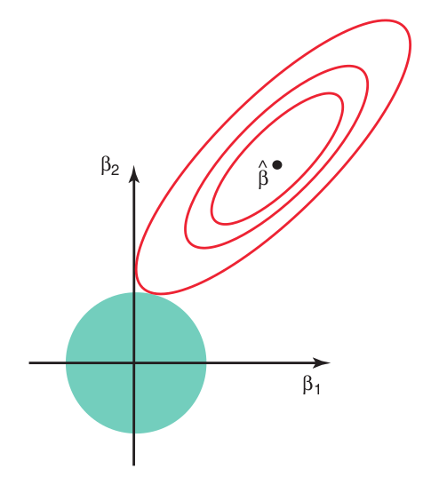

## Correlated Predictors

Back in module 5 we discussed multicollinearity, and how that can lead to coefficient estimates that have a high variance. This was because

$$
\text{V}\left[\boldsymbol{\hat{\beta}} \right]= \sigma^2 (\mathbf{X}^\intercal \mathbf{X})^{-1}
$$


## Big Idea

Recall from module 7:

$$
MSE(\hat{\boldsymbol{\beta}}_p) = V[\hat{\boldsymbol{\beta}}_p] + \text{Bias}[\hat{\boldsymbol{\beta}}_p]\text{Bias}[\hat{\boldsymbol{\beta}}_p]^\intercal
$$

- Regular OLS coefficients have no bias, so MSE equals the variance. 
- **Ridge Regression** will add some bias, but may dramatically reduce variance.
- It is also likely to improve prediction on out-of-sample data!

## Ridge Regression

```{r, out.width="700px", echo=F}

```


## Ridge Regression

Add a penalty to the loss function:

$$
(\mathbf{y} - \mathbf{X}\boldsymbol{\beta})^\intercal(\mathbf{y} - \mathbf{X}\boldsymbol{\beta}) + k \boldsymbol{\beta}^\intercal \boldsymbol{\beta} 
$$

where $k \ge 0$ is the **biasing parameter**. Calling it $\lambda$ is popular in the literature, too. 

Simplifying yields

$$
\mathbf{y}^\intercal \mathbf{y} - 2\mathbf{y}^\intercal \mathbf{X}\boldsymbol{\beta} +  \boldsymbol{\beta}^\intercal\left[ k \mathbf{I} + \mathbf{X}^\intercal \mathbf{X} \right] \boldsymbol{\beta}
$$


NB: for the moment, we are assuming that we don't have an intercept. More on this later.


## Ridge Regression


$$
(\mathbf{y} - \mathbf{X}\boldsymbol{\beta})^\intercal(\mathbf{y} - \mathbf{X}\boldsymbol{\beta}) + k \boldsymbol{\beta}^\intercal \boldsymbol{\beta} 
$$

This sort of loss function can be motivated a number of ways. One way is we can think of finding the Lagrangian of this constrained optimization problem:

\begin{gather}
\min_{\boldsymbol{\beta}} (\mathbf{y} - \mathbf{X}\boldsymbol{\beta})^\intercal(\mathbf{y} - \mathbf{X}\boldsymbol{\beta}) \\
\text{subject to  } \boldsymbol{\beta}^\intercal \boldsymbol{\beta} \le s
\end{gather}

The Lagrangian is 
$$
(\mathbf{y} - \mathbf{X}\boldsymbol{\beta})^\intercal(\mathbf{y} - \mathbf{X}\boldsymbol{\beta}) + k \left( \boldsymbol{\beta}^\intercal \boldsymbol{\beta} - s \right)
$$
but $ks$ doesn't matter. 

## Ridge Regression

```{r, echo=F, out.width="350px"}
 #ridge_lasso_comparison.png
```
[source: ISLR](https://www.amazon.com/Introduction-Statistical-Learning-Applications-Statistics/dp/1461471370)

## Ridge Regression


$$
\mathbf{y}^\intercal \mathbf{y} - 2\mathbf{y}^\intercal \mathbf{X}\boldsymbol{\beta} +  \boldsymbol{\beta}^\intercal\left[ k \mathbf{I} + \mathbf{X}^\intercal \mathbf{X} \right] \boldsymbol{\beta}
$$

Taking derivatives and setting the resulting expression to $\mathbf{0}$ yields different normal equations:

$$
\left[k \mathbf{I} + \mathbf{X}^\intercal \mathbf{X} \right] \boldsymbol{\hat{\beta}}_R = \mathbf{X}^\intercal \mathbf{y}
$$


## Ridge Regression

Solving 

$$
\left[ k \mathbf{I} + \mathbf{X}^\intercal \mathbf{X} \right] \boldsymbol{\hat{\beta}}_R = \mathbf{X}^\intercal \mathbf{y}
$$

yields
$$
\boldsymbol{\hat{\beta}}_R = (\mathbf{X}^\intercal \mathbf{X} + k\mathbf{I})^{-1} \mathbf{X}^\intercal \mathbf{y}
$$

c.f. regular OLS:

$$
\boldsymbol{\hat{\beta}} = (\mathbf{X}^\intercal \mathbf{X})^{-1} \mathbf{X}^\intercal \mathbf{y}
$$


## Ridge Regression


- $\boldsymbol{\hat{\beta}}_R = (\mathbf{X}^\intercal \mathbf{X} + k\mathbf{I})^{-1} \mathbf{X}^\intercal \mathbf{y}$
- $\boldsymbol{\hat{\beta}} = (\mathbf{X}^\intercal \mathbf{X})^{-1} \mathbf{X}^\intercal \mathbf{y}$

The Ridge Regression estimate is a linear transformation of the OLS estimate

$$
\boldsymbol{\hat{\beta}}_R = (\mathbf{X}^\intercal \mathbf{X} + k\mathbf{I})^{-1} \mathbf{X}^\intercal \mathbf{y} = (\mathbf{X}^\intercal \mathbf{X} + k\mathbf{I})^{-1} (\mathbf{X}^\intercal \mathbf{X}) \boldsymbol{\hat{\beta}} = \mathbf{Z}_k \boldsymbol{\hat{\beta}}
$$

- this helps us find the bias vector and the covariance matrix.

## Ridge Regression's Bias

- $\boldsymbol{\hat{\beta}}_R = (\mathbf{X}^\intercal \mathbf{X} + k\mathbf{I})^{-1} \mathbf{X}^\intercal \mathbf{y}$
- $\boldsymbol{\hat{\beta}} = (\mathbf{X}^\intercal \mathbf{X})^{-1} \mathbf{X}^\intercal \mathbf{y}$
- $\boldsymbol{\hat{\beta}}_R = \mathbf{Z}_k \boldsymbol{\hat{\beta}}$
- $\mathbf{Z}_k = (\mathbf{X}^\intercal \mathbf{X} + k\mathbf{I})^{-1}(\mathbf{X}^\intercal \mathbf{X})$

$$
E\left[ \boldsymbol{\hat{\beta}}_R \right] = \mathbf{Z}_kE\left[ \boldsymbol{\hat{\beta}} \right] = \mathbf{Z}_k \boldsymbol{\beta}
$$


## Ridge Regression's Variance

- $\boldsymbol{\hat{\beta}}_R = (\mathbf{X}^\intercal \mathbf{X} + k\mathbf{I})^{-1} \mathbf{X}^\intercal \mathbf{y}$
- $\boldsymbol{\hat{\beta}} = (\mathbf{X}^\intercal \mathbf{X})^{-1} \mathbf{X}^\intercal \mathbf{y}$
- $\boldsymbol{\hat{\beta}}_R = \mathbf{Z}_k \boldsymbol{\hat{\beta}}$
- $\mathbf{Z}_k = (\mathbf{X}^\intercal \mathbf{X} + k\mathbf{I})^{-1}(\mathbf{X}^\intercal \mathbf{X})$

$$
\text{V}\left[ \boldsymbol{\hat{\beta}}_R \right] = \mathbf{Z}_k \text{V}\left[ \boldsymbol{\hat{\beta}} \right]\mathbf{Z}_k^\intercal = \sigma^2 \mathbf{Z}_k \left(\mathbf{X}^\intercal \mathbf{X} \right)^{-1} \mathbf{Z}_k^\intercal = \sigma^2 (\mathbf{X}^\intercal \mathbf{X} + k\mathbf{I})^{-1}\left(\mathbf{X}^\intercal \mathbf{X} \right)(\mathbf{X}^\intercal \mathbf{X} + k\mathbf{I})^{-1}
$$

The book takes the trace of the following, which gives us the total variance (ignoring covariances).

## The Spectral Representation Theorem 

A special case of the **spectral representation theorem (for matrices)** states that any real, symmetric, matrix is orthogonally diagonalizable. For us this means that
$$
\mathbf{X}^\intercal \mathbf{X} = \mathbf{U} \mathbf{D}\mathbf{U}^\intercal
$$
where 

- the columns of $\mathbf{U}$ are the eigenvectors
- $\mathbf{U}\mathbf{U}^\intercal  = \mathbf{U}^\intercal\mathbf{U} = \mathbf{I}$ (orthogonal)
- $\mathbf{D} = \text{diag}\left(\lambda_1, \lambda_1, \ldots, \lambda_{p-1} \right)$ are the eigenvalues
- positive-definiteness implies that the eigenvalues are positive!


## Using The Spectral Representation Theorem 


$$
\mathbf{X}^\intercal \mathbf{X} = \mathbf{U} \mathbf{D}\mathbf{U}^\intercal
$$


This is helpful for us here because

- $\mathbf{X}^\intercal \mathbf{X} + k\mathbf{I} = \mathbf{U}\left[ \mathbf{D} + k \mathbf{I} \right]\mathbf{U}^\intercal$
- $[\mathbf{X}^\intercal \mathbf{X} + k\mathbf{I}]^{-1} = \mathbf{U}\left[ \mathbf{D} + k \mathbf{I} \right]^{-1}\mathbf{U}^\intercal$

$$
[\mathbf{X}^\intercal \mathbf{X} + k\mathbf{I}]^{-1}[\mathbf{X}^\intercal \mathbf{X}][\mathbf{X}^\intercal \mathbf{X} + k\mathbf{I}]^{-1} = 
\mathbf{U}
\begin{bmatrix}
\frac{\lambda_1}{(\lambda_1 + k)^2 } & \cdots & 0 \\
\vdots & \ddots & \vdots \\
0 & \cdots & \frac{\lambda_{p-1}}{(\lambda_{p-1} + k)^2}
\end{bmatrix}
\mathbf{U}^\intercal
$$

Taking the trace on both sides gives us $\text{tr}\left(\text{V}\left[ \boldsymbol{\hat{\beta}}_R \right] \right) = \sigma^2 \sum_{i=0}^{p-1} \frac{\lambda_i}{(\lambda_i + k)^2}$


## Using The Spectral Representation Theorem 


- $\mathbf{X}^\intercal \mathbf{X} = \mathbf{U} \mathbf{D}\mathbf{U}^\intercal$
- $\mathbf{X}^\intercal \mathbf{X} + k\mathbf{I} = \mathbf{U}\left[ \mathbf{D} + k \mathbf{I} \right]\mathbf{U}^\intercal$

We can also see why they call $k$ the biasing parameter:


$$
E\left[ \boldsymbol{\hat{\beta}}_R - \boldsymbol{\beta} \right] = \mathbf{Z}_k - \mathbf{I}
=
\mathbf{U}
\begin{bmatrix}
\frac{\lambda_1}{\lambda_1 + k } & \cdots & 0 \\
\vdots & \ddots & \vdots \\
0 & \cdots & \frac{\lambda_{p-1}}{\lambda_{p-1} + k}
\end{bmatrix}
\mathbf{U}^\intercal - \mathbf{U}\mathbf{U}^\intercal
=
\mathbf{U}
\begin{bmatrix}
\frac{-k}{\lambda_1 + k } & \cdots & 0 \\
\vdots & \ddots & \vdots \\
0 & \cdots & \frac{-k}{\lambda_{p-1} + k}
\end{bmatrix}
\mathbf{U}^\intercal
$$


## More realistic

In practice usually the intercept is not penalized. Instead we fix $k$ and choose $\hat{\boldsymbol{\beta}}_R$ to minimize

$$
(\mathbf{y} - \mathbf{X}\boldsymbol{\beta})^\intercal(\mathbf{y} - \mathbf{X}\boldsymbol{\beta}) + k \sum_{j=1}^{p-1} \beta_j^2,
$$
where the penalty term doesn't include $\boldsymbol{\beta}_0$. 

Taking the derivatives and setting all of them equal to $0$ yields new **normal equations**:

$$
\left[k \text{ diag}(0, 1, \ldots, 1) + \mathbf{X}^\intercal \mathbf{X} \right] \boldsymbol{\hat{\beta}}_R = \mathbf{X}^\intercal \mathbf{y}
$$


## More realistic

$$
\left[k \text{ diag}(0, 1, \ldots, 1) + \mathbf{X}^\intercal \mathbf{X} \right] \boldsymbol{\hat{\beta}}_R = \mathbf{X}^\intercal \mathbf{y}
$$

Notice the first row is the same as the OLS:
$$
\sum_{i=1}^n y_i = n \hat{\beta}_0 + \hat{\beta}_1  \sum_{i=1}^n x_{i1} + \cdots + \hat{\beta}_{p-1}  \sum_{i=1}^n x_{i,p-1} 
$$

- if your predictors are demeaned $\hat{\beta}_0 = \bar{y}$
- if both predictors and $y$ are demeaned, intercept should be $0$


Read the documentation, because every function is different!


## More realistic

Another thing that this book fails to mention is that scaling predictors is often important.

The reason this is done is so that the **penalty is applied evenly to all predictors**.

$$
\tilde{x}_{i,j} = \frac{x_{i,j} - \bar{x}_j}{s_j}
$$

where $\bar{x}_j = n^{-1} \sum_{i=1}^n x_{i,j}$ and $s_j^2 = (n-1)^{-1} \sum_{i=1}^n (x_{i,j} - \bar{x}_j)^2$. 


## Selecting $k$

Increasing $k$ 

- increases bias :(
- reduces variance :)


How do we pick the "best" $k$?

The book recommends me use the **ridge trace**, which is a plot of the ridge coefficient estimates versus $k$.


## Selecting $k$

```{r, out.width="400px"}
library(glmnet)
head(longley)
X <- model.matrix(GNP.deflator ~ ., data = longley)
possible_k <- seq(0, 10, .05)
mod <- glmnet(x = X,
              y = as.matrix(longley[,1]),
              family = "gaussian",
              alpha = 0, # 0 for ridge regression
              lambda = possible_k,
              standardize = T, # default is T 
              intercept = T)
plot(mod, xvar = "lambda", label=T)
```


## selecting $k$

`glmnet` also provides a method that can select $k$ using cross-validation: `cv.glmnet()`

```{r}
mod2 <- cv.glmnet(x = X,
                  y = as.matrix(longley[,1]),
                  family = "gaussian",
                  alpha = 0, # 0 for ridge regression
                  standardize = T, # default is T 
                  intercept = T,
                  nfolds = 3)
plot(mod2)
```

- `mod2$lambda.min` the first vertical line, minimizes out of sample MSE
- `mod2$lambda.1se` second vertical line, adds one std. error to be conservative
- numbers on the top are the number of nonzero coefficients


## The Lasso

Ridge regression chooses $\hat{\boldsymbol{\beta}}_R$, for a fixed $k$, to minimize

$$
(\mathbf{y} - \mathbf{X}\boldsymbol{\beta})^\intercal(\mathbf{y} - \mathbf{X}\boldsymbol{\beta}) + k \sum_{j=1}^{p-1} \beta_j^2,
$$
while **the Lasso** minimizes

$$
(\mathbf{y} - \mathbf{X}\boldsymbol{\beta})^\intercal(\mathbf{y} - \mathbf{X}\boldsymbol{\beta}) + k \sum_{j=1}^{p-1} |\beta_j|.
$$

This small change leads to very different behavior! 

## The Lasso

For any  $0 < k < \infty$, ridge regression will always have all predictors in the model. It does not perform variable selection.

The Lasso does, though! Increasing $k$ will eliminate more and more predictors from the model, until only the intercept is left. Very useful if you want to figure out **which predictors** are the most useful. 

To get a sense for why this is true, we can rewrite the minimization problem as follows:

$$
\min_{\beta}(\mathbf{y} - \mathbf{X}\boldsymbol{\beta})^\intercal(\mathbf{y} - \mathbf{X}\boldsymbol{\beta}) \hspace{5mm} \text{subject to} \sum_{j=1}^{p-1}|\beta_j| \le s
$$


## The Lasso


This plot is a classic:

```{r, echo=F, out.width="450px"}
 #
```
[source: ISLR](https://www.amazon.com/Introduction-Statistical-Learning-Applications-Statistics/dp/1461471370)


## The Lasso

Most of the time we have to do the following two step procedure:

- estimate $k$ (ideally with cross-validation using `cv.glmnet`)
- use the chosen $k$ to estimate the regression coefficients


## The Lasso

Step 1/2: perform cross-validation to choose $k$

```{r, out.width="400px"}
mod3 <- cv.glmnet(x = X,
                  y = as.matrix(longley[,1]),
                  family = "gaussian",
                  alpha = 1, # 0 for ridge regression, 1 for lasso
                  standardize = T, # default is T 
                  intercept = T,
                  nfolds = 3)
bestK <- mod3$lambda.min
cat("best k is ", bestK, "\n")
plot(mod3)
```


## The Lasso

Step 2/2: Use the chosen $k$ to estimate the coefficients
```{r, out.width="400px"}
mod4 <- glmnet(x = X,
              y = as.matrix(longley[,1]),
              family = "gaussian",
              alpha = 1, # lasso=1, ridge=0 (see dox)
              lambda = bestK, # calculated in the last slide
              standardize = T, 
              intercept = T)
predict(mod4, newx = X[c(3,5),])
```


## The Lasso

Instead of picking a single $k$, we can plotting coefficient estimates versus many different $k$s...

```{r, out.width="400px"}
# plot.glmnet is different than plot.cv.glmnet
# we let glmnet calculate several k values instead of supplying our own
plot(glmnet(x = X,
              y = as.matrix(longley[,1]),
              family = "gaussian",
              alpha = 1, # lasso=1, ridge=0 (see dox)
              standardize = T, 
              intercept = T),
     xvar = "lambda")
```


## The Lasso

Lasso beats Ridge at performing variable selection, but which model predicts the best?


## Lasso versus Ridge 

Lasso beats Ridge at performing variable selection, but which model predicts the best?

Very generally, Lasso predicts better when you have too many possible predictors, and very few of them actually have coefficients that are far away from $0$. 

Ridge regression performs better when many coefficients are far away from $0$, and they're all roughly the same size.

Unfortunately, these are rarely known before you look at the data, so cross-validation is your friend!

## PCA regression

As long as we're talking about variable selection, we should mention **principal components analysis**. 

Principal components can be used a few ways, but we use it for choosing which predictors to include in a regression model.

This is a very useful tool when you have many columns and a lot of multicollinearity. It is a principled way to combine and remove columns.

## PCA regression

Let's plot our two predictor columns:

```{r, echo=F, out.width = "400px"}
set.seed(4)
myDf <- data.frame(rnorm(100), matrix(rnorm(200), ncol = 2) %*% matrix(c(1, .8, .8, 1), ncol = 2))
colnames(myDf) <- c("y", "x1", "x2")
plot(myDf$x1, myDf$x2) # vis
```

what do we do about this correlation?


## PCA regression

PCA will help us reduce the number of columns. In this case we reduce two columns into $1$. However, there are a few pre-processing steps:

- we ignore the intercept for the time being
- each column must be de-meaned
- each column must be standardized to give it sample variance $1$

When we write $\mathbf{X}$, we are assuming all these things have already been done.


## PCA regression

The **first** principal component is a linear combination of your $p-1$, zero-mean predictors:

\begin{align*}
\mathbf{z}_1 &= \phi_{11} \mathbf{X}_1 + \phi_{21} \mathbf{X}_2 + \cdots + \phi_{p-1,1} \mathbf{X}_{p-1} \\
&= \mathbf{X}\boldsymbol{\phi}_1
\end{align*}

that maximizes the sample variance of the elements of $\mathbf{z}_1$, restricting $\boldsymbol{\phi}_1^\intercal\boldsymbol{\phi}_1 = \sum_{j=1}^{p-1} \phi_{j1}^2 = 1$.


## PCA regression

So the first principal component $\mathbf{z}_1 = \mathbf{X}\boldsymbol{\phi}_1$ solves the following constrained optimization problem:

$$
\max \frac{1}{n-1}\mathbf{z}_1^\intercal \mathbf{z}_1 \hspace{5mm} \text{subject to } \hspace{5mm} \boldsymbol{\phi}_1^\intercal\boldsymbol{\phi}_1  = 1
$$


## PCA regression

To maximize $\frac{1}{n-1}\mathbf{z}_1^\intercal \mathbf{z}_1$, it is handy to use the Spectral Representation Theorem $\mathbf{X}^\intercal \mathbf{X} = \mathbf{U} \mathbf{D} \mathbf{U}^\intercal$.

\begin{align*}
\frac{1}{n-1}\mathbf{z}_1^\intercal \mathbf{z}_1 &= \frac{1}{n-1}\left(\mathbf{X}\boldsymbol{\phi}_1\right)^\intercal\left(\mathbf{X}\boldsymbol{\phi}_1 \right) \tag{defn. of $\mathbf{z}_1$} \\
&= \frac{1}{n-1}\boldsymbol{\phi}_1^\intercal\left(\mathbf{X}^\intercal \mathbf{X} \right)\boldsymbol{\phi}_1 \tag{property of transpose}\\
&= \frac{1}{n-1}\boldsymbol{\phi}_1^\intercal\left(\mathbf{U} \mathbf{D} \mathbf{U}^\intercal \right)\boldsymbol{\phi}_1 \tag{SRT} \\
&= \frac{1}{n-1}\boldsymbol{\phi}_1^\intercal\left(\sum_{i=1}^p\lambda_i \mathbf{U}_i \mathbf{U}_i^\intercal \right)\boldsymbol{\phi} \tag{matrix mult.} \\
&= \frac{1}{n-1}\sum_{i=1}^p \lambda_i \left(\boldsymbol{\phi}_1^\intercal \mathbf{U}_i \mathbf{U}_i^\intercal \boldsymbol{\phi}_1\right) 
\end{align*}

So... what's $\boldsymbol{\phi}_1$?

## PCA regression

So, the **weight vector of the first principal component is the eigenvector with the largest eigenvalue**!

WLOG assume $\lambda_1 > \lambda_2 > \cdots > \lambda_{p-1}$ when you write $\mathbf{X}^\intercal \mathbf{X} = \mathbf{U} \mathbf{D} \mathbf{U}^\intercal$.

If we do that, we set $\boldsymbol{\phi}_1 = \mathbf{U}_1$. In this case, the first principal component is defined by the first eigenvector.

## PCA Regression


```{r, out.width="400px"}
head(myDf) # all the data (make sure it's mean 0!)
X <- as.matrix(myDf[,-1]) # ignore y for the time being
eigenStuff <- eigen(t(X) %*% X) 
eigenStuff$values # make sure first is the biggest 
(firstEigenVector <- eigenStuff$vectors[,1]) # get the first eigenvector
plot(myDf$x1, myDf$x2) # vis
arrows(0,0, firstEigenVector[1], firstEigenVector[2], col = "red")
# finally, combine the two columns into the one, first principal component
(firstPrinComp <- X %*% firstEigenVector)
```


## PCA regression

The second principal component $\mathbf{z}_2 = \mathbf{X}\mathbf{U}_2$ maximizes the variance under the same restriction, plus an extra one: 
$$
\mathbf{z}_1  \text{ must be uncorrelated with } \mathbf{z}_2.
$$

This happens iff

$$
\mathbf{z}_1^\intercal \mathbf{z}_2 = 0.
$$

## PCA regression


We need the Spectral Representation Theorem again: $\mathbf{X}^\intercal \mathbf{X} = \mathbf{U} \mathbf{D} \mathbf{U}^\intercal$

$$
\mathbf{z}_1^\intercal \mathbf{z}_2 = 0
$$

iff

$$
\left(\mathbf{X}\boldsymbol{\phi}_1\right)^\intercal \left(\mathbf{X}\boldsymbol{\phi}_2\right) = 0
$$

iff

$$
\sum_{i=1}^{p-1} \lambda_i \left(\boldsymbol{\phi}_1^\intercal \mathbf{U}_i \mathbf{U}_i^\intercal \boldsymbol{\phi}_2\right)
= 0
$$


## PCA regression

So, given $\boldsymbol{\phi}_1$, if we wanted to pick a unit-length vector $\boldsymbol{\phi}_2$ to maximize 

$$
\frac{1}{n-1}\mathbf{z}_2^\intercal \mathbf{z}_2 = \frac{1}{n-1}\sum_{i=1}^{p-1} \lambda_i \left(\boldsymbol{\phi}_2^\intercal \mathbf{U}_i \mathbf{U}_i^\intercal \boldsymbol{\phi}_2\right) 
$$

subject to 

$$
\frac{1}{n-1}\sum_{i=1}^{p-1} \lambda_i \left(\boldsymbol{\phi}_1^\intercal \mathbf{U}_i \mathbf{U}_i^\intercal \boldsymbol{\phi}_2\right)
= 0
$$

what would it be?

## PCA regression

In general, the weights are

- $\boldsymbol{\phi}_1 = \mathbf{U}_1$
- $\boldsymbol{\phi}_2 = \mathbf{U}_2$
- $\boldsymbol{\phi}_3 = \mathbf{U}_3$
- etc. etc.

So the principal components themselves are

- $\mathbf{z}_1 = \mathbf{X}\mathbf{U}_1$
- $\mathbf{z}_2 = \mathbf{X}\mathbf{U}_2$
- $\mathbf{z}_3 = \mathbf{X}\mathbf{U}_3$
- etc. etc.


## PCA regression

With two columns of data, we have at most two principal components

```{r, out.width="400px", echo=F}
plot(myDf$x1, myDf$x2, asp = 1) # vis
arrows(0,0,firstEigenVector[1], firstEigenVector[2], col = "red")
secondEigenVector <- eigenStuff$vector[,2]
arrows(0,0, secondEigenVector[1], secondEigenVector[2], col = "blue")
```

## PCA regression

Compare the plot of $\mathbf{X}$ with the plot of $\mathbf{X} \begin{bmatrix} \mathbf{U}_1 & \mathbf{U}_2 \end{bmatrix}$

```{r, out.width="400px", echo=F}
par(mfrow=c(1,2))
plot(myDf$x1, myDf$x2, asp = 1, xlab = "X1", ylab = "X2") # vis
arrows(0,0,firstEigenVector[1], firstEigenVector[2], col = "red")
secondEigenVector <- eigenStuff$vector[,2]
arrows(0,0, secondEigenVector[1], secondEigenVector[2], col = "blue")
plot((as.matrix(myDf[,-1]) %*% eigenStuff$vector)[,1], 
     (as.matrix(myDf[,-1]) %*% eigenStuff$vector)[,2], 
     asp = 1,
     xlab = "X U1",
     ylab = "X U2")
arrows(0,0,1,0, col = "red")
arrows(0,0,0,1, col = "blue")
par(mfrow=c(1,1))
```

- no more correlation! 
- we can ignore the second principal component predictor!


## PCA regression

In general, the sample variance of $\mathbf{z}_i$ is $\lambda_i$ because
$$
\frac{1}{n-1}\mathbf{z}_i^\intercal\mathbf{z}_i  = \frac{1}{n-1}\mathbf{U}_i^\intercal \mathbf{U} \mathbf{D} \mathbf{U}^\intercal\mathbf{U}_i = \frac{\lambda_i}{n-1}
$$

When we have more than two columns, we have to pick how many principal component predictors to ignore. We ignore principal components if they have a small variance. A plot of the variances is called a **Scree plot**


## PCA regression

```{r, out.width = "400px"}
X <- model.matrix(GNP.deflator ~ . + 0, data = longley)
head(X)
X <- scale(x = X, center = TRUE, scale = TRUE) 
# demeaning is necessary; scaling is highly-advisable
head(X)
eigenStuff <- eigen(t(X) %*% X)
plot(eigenStuff$values, 
     ylab = "lambda_i", xlab = "i",
     type = "b", main = "Scree plot")
```

We *probably* only need the first two principal components. So we just reduced six columns into $2$!

## PCA regression

What is the **interpretation of the first principal component**?

```{r}
eigenStuff$vectors[,1]  # U1
head(X)
```


## PCA regression

What is the **interpretation of the first principal component**?

```{r}
eigenStuff$vectors[,1]  # U1
plot.ts(X)
```

## PCA regression

What is the **interpretation of the second principal component**?

```{r}
eigenStuff$vectors[,2]  # U2
```


## PCA regression

What is the **interpretation of the second principal component**?

```{r}
par(mfrow=c(1,2))
plot.ts(X[,3] - X[,2], ylab = "armed forces - unemploymed")
z2 <- (X %*% eigenStuff$vectors[,2]) # second princomp
plot.ts(z2, ylab = "second prinComp")
par(mfrow=c(1,1))
```


## PCA regression

On this "longley" data set, we have:

- demeaned and standardized each predictor column
- found (in this case two) principal components $\mathbf{z}_i$


Now it's time to run the regression!


## PCA regression


```{r}
pcaDf <- data.frame(longley$GNP.deflator, 
                    (X %*% eigenStuff$vectors)[,1:2])
colnames(pcaDf) <- c("y", "z1", "z2")
pcaReg <- lm(y ~ z1 + z2, data = pcaDf)
summary(pcaReg)
```


## PCA regression

Here's the regression on everything

```{r}
summary(lm(GNP.deflator ~ .,
           data = longley))
```
