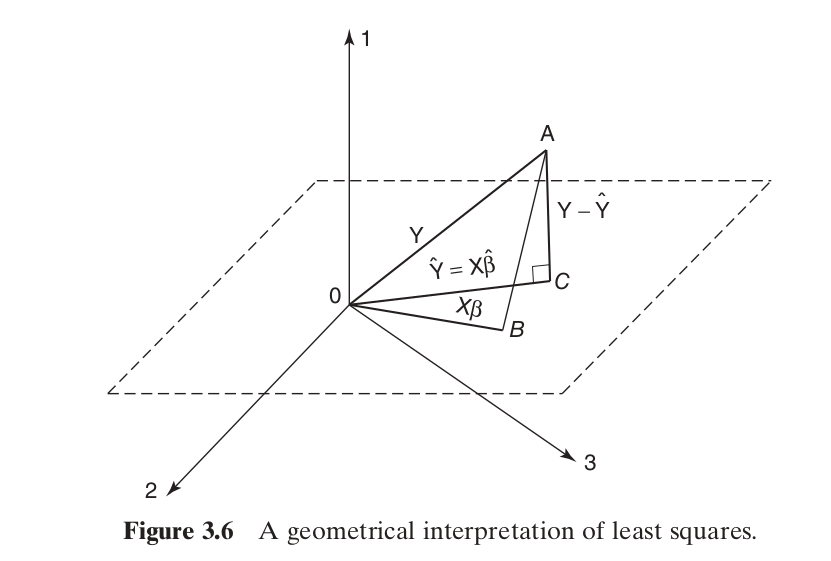

<!-- output: html_document: -->
<!--   toc: true -->
<!--   theme: united -->

<!-- output:  -->
<!--   revealjs::revealjs_presentation: -->
<!--     center: false -->


<!-- <link href="../styles.css" rel="stylesheet"> -->

## Multiple Linear Regression

More predictors!

$$
y = \beta_0 + \beta_1 x_1 + \beta_2x_2 + \cdots + \beta_k x_k + \epsilon
$$

tip: don't say "multivariate"

## Multiple Linear Regression

$$
E[y] = \beta_0 + \beta_1 x_1 + \beta_2x_2 + \cdots + \beta_k x_k
$$

* $\frac{dE[y]}{dx_3} = \beta_3$

* one unit change in $x_3$

* assumes all other regressors aren't changing

* disregards noise


These are *very* flexible...

## Multiple Linear Regression

Special case example: polynomial regression

$$
y = \beta_0 + \beta_1 x + \beta_2 x^2 + \beta_3 x^3 + \epsilon
$$

```{r cubic_plot, echo=TRUE, out.width="500px"}
betas <- c(-1,2,-3)
x <- seq(-3,3,.1)
y_line <- cbind(x,x^2,x^3) %*% betas
y <- y_line +  rnorm(n = length(x), sd = 20)
plot(x,y)
points(x,y_line, col="red", type = "l")
```


## Multiple Linear Regression

Special case example: interaction effects
$$
y = \beta_0 + \beta_1 x_1 + \beta_2 x_2 + \beta_3 x_1x_2 + \epsilon
$$
with 
$(\beta_0, \beta_1, \beta_2, \beta_3) = (-2, 3, -.2, -4)$

```{r interac_plot, echo=FALSE, out.width="1000px"}
plotSurface <- function(lowerFirst, upperFirst, 
                        lowerSecond, upperSecond, 
                        numGridPointsOnEachAxis, f, contour = F, ...){
  A <- seq(lowerFirst, upperFirst, length.out = numGridPointsOnEachAxis)
  B <- seq(lowerSecond, upperSecond, length.out = numGridPointsOnEachAxis)
  args <- expand.grid(A,B)
  z <- mapply(f, args[,1], args[,2])
  dim(z) <- c(length(A), length(B))
  if(contour){
    contour(A, B, z)
  }else{
    persp(x=A, y=B, z=z, ...)
  }
}
eval_mean <- function(x1, x2) -2 + 3*x1 - .2*x2 - 4*x1*x2
plotSurface(-5, 5, -5, 5, 50, 
            eval_mean, F, theta=-120, 
            zlab = "E[y]", xlab = "x1", ylab = "x2")
```


## Multiple Linear Regression

Special case example: second-order model with interactions

$$
y = \beta_0 + \beta_1 x_1 + \beta_2 x_2 + \beta_3 x_1^2 + \beta_4 x_2^2 + \beta_5x_1x_2 + \epsilon
$$
with $(\beta_0, \beta_1, \beta_2, \beta_3, \beta_4, \beta_5) = (800, 10, 7, 8.5, -5, 4)$


```{r sec_order_plot, echo=FALSE, out.width="1000px"}
plotSurface <- function(lowerFirst, upperFirst, 
                        lowerSecond, upperSecond, 
                        numGridPointsOnEachAxis, f, contour = F, ...){
  A <- seq(lowerFirst, upperFirst, length.out = numGridPointsOnEachAxis)
  B <- seq(lowerSecond, upperSecond, length.out = numGridPointsOnEachAxis)
  args <- expand.grid(A,B)
  z <- mapply(f, args[,1], args[,2])
  dim(z) <- c(length(A), length(B))
  if(contour){
    contour(A, B, z)
  }else{
    persp(x=A, y=B, z=z, ...)
  }
}
eval_mean <- function(x1, x2) (800+10*x1 + 7*x2+ 8.5*x1^2+ -5*x2^2+ 4*x1*x2)
plotSurface(0, 10, 0, 10, 50, 
            eval_mean, F, theta=-50, 
            zlab = "E[y]", xlab = "x1", ylab = "x2")
```


## Estimating the coefficients

To estimate the coefficients , we again look at the loss
$$
S(\beta_0, \beta_1, \ldots, \beta_k) = \sum_{i=1}^n(y_i - [\beta_0 + \beta_1 x_{i1} + \beta_2 x_{i2} + \cdots + \beta_k x_{ik}])^2
$$
We take derivatives with respect to all betas, and set them all equal to $0$, and then solve the system of equations...


## Matrices to the rescue

It's cleaner if we use matrices

$$
\mathbf{y} = \mathbf{X} \boldsymbol{\beta} + \boldsymbol{\epsilon}
$$

$$
\mathbf{y}
=
\begin{bmatrix}
y_1 \\
\vdots \\
y_n
\end{bmatrix}
\hspace{10mm}
\mathbf{X}
=
\begin{bmatrix}
1 & x_{11} & \cdots & x_{1k} \\
1 & x_{21} & \cdots & x_{2k}\\
\vdots & \vdots & & \vdots \\
1 & x_{n1} & \cdots & x_{nk}
\end{bmatrix}
=
\begin{bmatrix}
\mathbf{x}_1^{\intercal} \\
\mathbf{x}_2^{\intercal}\\
\vdots  \\
\mathbf{x}_n^{\intercal}
\end{bmatrix}
$$

$$
\boldsymbol{\beta}
=
\begin{bmatrix}
\beta_0 \\
\beta_1 \\
\vdots \\
\beta_k
\end{bmatrix}
\hspace{10mm}
\boldsymbol{\epsilon}
=
\begin{bmatrix}
\epsilon_1 \\
\epsilon_2\\
\vdots\\
\epsilon_{n}
\end{bmatrix}
$$

## Matrices to the rescue

rewriting the loss

\begin{align*}
S(\beta_0, \beta_1, \ldots, \beta_k) &= S(\boldsymbol{\beta})\\
&= \sum_{i=1}^n(y_i - [\beta_0 + \beta_1 x_1 + \beta_2x_2 + \cdots + \beta_k x_k])^2 \\
&= \sum_{i=1}^n(y_i - \mathbf{x}_i^{\intercal}\boldsymbol{\beta} )^2 \\
&= (\mathbf{y} - \mathbf{X} \boldsymbol{\beta})^{\intercal}(\mathbf{y} - \mathbf{X} \boldsymbol{\beta})
\end{align*}

Warning: you have to equivocate on $\boldsymbol{\beta}$ or $\boldsymbol{\epsilon}$. The book has chosen the second option; however, we always use $\epsilon$ to refer to true, unobserved random errors, not residuals. Instead, when we write the loss, we are not thinking of $\boldsymbol{\beta}$ as the true coefficient vector; instead, we think of it as some input vector for this score function.


## Matrices to the rescue

A few more moves

\begin{align*}
S(\boldsymbol{\beta}) &= (\mathbf{y} - \mathbf{X} \boldsymbol{\beta})^{\intercal}(\mathbf{y} - \mathbf{X} \boldsymbol{\beta}) \\
&= (\mathbf{y}^{\intercal} - [\mathbf{X} \boldsymbol{\beta}]^{\intercal})(\mathbf{y} - \mathbf{X} \boldsymbol{\beta}) \\
&=(\mathbf{y}^{\intercal} - \boldsymbol{\beta}^{\intercal} \mathbf{X}^{\intercal} )(\mathbf{y} - \mathbf{X} \boldsymbol{\beta}) \\
&= \mathbf{y}^{\intercal}\mathbf{y} - \mathbf{y}^{\intercal}\mathbf{X} \boldsymbol{\beta} \\
&\hspace{10mm} - \boldsymbol{\beta}^{\intercal} \mathbf{X}^{\intercal} \mathbf{y} + \boldsymbol{\beta}^{\intercal} \mathbf{X}^{\intercal}\mathbf{X} \boldsymbol{\beta} \\
&= \mathbf{y}^{\intercal}\mathbf{y} - 2\mathbf{y}^{\intercal}\mathbf{X} \boldsymbol{\beta}  + \boldsymbol{\beta}^{\intercal} \mathbf{X}^{\intercal}\mathbf{X} \boldsymbol{\beta}
\end{align*}

## Matrices to the rescue

taking the derivatives of the loss $S(\boldsymbol{\beta}) = \mathbf{y}^{\intercal}\mathbf{y} - 2\mathbf{y}^{\intercal}\mathbf{X} \boldsymbol{\beta}  + \boldsymbol{\beta}^{\intercal} \mathbf{X}^{\intercal}\mathbf{X} \boldsymbol{\beta}$

$$
\frac{\partial S}{\partial\boldsymbol{\beta} } = -2\mathbf{X}^{\intercal} \mathbf{y} + 2\mathbf{X}^{\intercal}\mathbf{X}\boldsymbol{\beta} \overset{\text{set}}{=} 0
$$
rearranging yields the *normal* equations
$$
(\mathbf{X}^{\intercal}\mathbf{X})\boldsymbol{\hat{\beta}}  = \mathbf{X}^{\intercal} \mathbf{y}
$$
and solving for the coefficient vector finally gives us
$$
\boldsymbol{\hat{\beta}} = (\mathbf{X}^{\intercal}\mathbf{X})^{-1}\mathbf{X}^{\intercal} \mathbf{y}
$$
multiplying both sides by the design matrix gives us the predictions
$$
\hat{\mathbf{y}} \overset{\text{def}}{=} \mathbf{X}\boldsymbol{\hat{\beta}} = \mathbf{X}(\mathbf{X}^{\intercal}\mathbf{X})^{-1}\mathbf{X}^{\intercal} \mathbf{y}
$$


## The hat matrix

$$
\hat{\mathbf{y}} \overset{\text{def}}{=} \mathbf{X}\boldsymbol{\hat{\beta}} = \mathbf{X}(\mathbf{X}^{\intercal}\mathbf{X})^{-1}\mathbf{X}^{\intercal} \mathbf{y}
$$

The matrix 
$$
\mathbf{H} = \mathbf{X}(\mathbf{X}^{\intercal}\mathbf{X})^{-1}\mathbf{X}^{\intercal}
$$ 
is special. It is called the *hat matrix* or *projection matrix*. 


## The residuals


$$
\hat{\mathbf{y}} \overset{\text{def}}{=} \mathbf{X}\boldsymbol{\hat{\beta}} = \mathbf{X}(\mathbf{X}^{\intercal}\mathbf{X})^{-1}\mathbf{X}^{\intercal} \mathbf{y}
$$

We'll use these quite often

$$
\mathbf{e} = \mathbf{y} - \hat{\mathbf{y}} =(\mathbf{I}_n - \mathbf{H}) \mathbf{y}
$$

## Using `R`

What to do?

```{r fake_data, echo=F}
x <- seq(-10,10,1)
my_df <- data.frame(y = (3 + 2*x - 5*x^2) + rnorm(length(x), sd = 30), x = x)
head(my_df)
```

```{r scatter_plot, echo=T, out.width="600px"}
plot(my_df$x, my_df$y)
```

## Using `R`


```{r mlr1, echo=T}
my_df$xsquared <- x^2
mlr_model <- lm(y ~ x + xsquared, data=my_df)
summary(mlr_model)
```

## Using `R`


```{r mlr2, echo=T}
fitted_vals <- predict(mlr_model)
plot(my_df$x, my_df$y)
points(my_df$x, fitted_vals, col = "red", type ="l")
```


## Back to the normal equations


$$
(\mathbf{X}^{\intercal}\mathbf{X}) \boldsymbol{\hat{\beta}}  = \mathbf{X}^{\intercal} \mathbf{y}
$$
If $\mathbf{X} = \begin{bmatrix} \mathbf{1} & \mathbf{x}_1 & \cdots & \mathbf{x}_k \end{bmatrix}$
\begin{align*}
\mathbf{X}^{\intercal}\mathbf{X} &= 
\begin{bmatrix}
\mathbf{1}^{\intercal} \\
\mathbf{x}_1^{\intercal} \\
\vdots \\
\mathbf{x}_k^{\intercal}
\end{bmatrix}
\begin{bmatrix} \mathbf{1} & \mathbf{x}_1 & \cdots & \mathbf{x}_k \end{bmatrix} \\
&=
\begin{bmatrix}
n & \sum_i x_{i1} & \sum_i x_{i2} & \cdots & \sum_i x_{ik} \\
\sum_i x_{i1} & \sum_i x_{i1}^2 & \sum_i x_{i1}x_{i2} & \cdots & \sum_i x_{i1}x_{ik} \\
\vdots & \vdots & \vdots & \ddots & \vdots\\
\sum_i x_{ik} & \sum_i x_{i1}x_{ik} & \sum_i x_{i2}x_{ik} & \cdots & \sum_i x_{ik}^2
\end{bmatrix}
\end{align*}

[a popular thread](https://stats.stackexchange.com/questions/22501/is-there-an-intuitive-interpretation-of-ata-for-a-data-matrix-a/22520#22520)

## Back to the normal equations

Rearranging the normal equations

$$
(\mathbf{X}^{\intercal}\mathbf{X}) \boldsymbol{\hat{\beta}}  = \mathbf{X}^{\intercal} \mathbf{y}
$$
$$
\mathbf{X}^{\intercal} \left(   \mathbf{y} - \mathbf{X} \boldsymbol{\hat{\beta}}\right) = \mathbf{0}
$$

can  yield a geometrical interpretation. Choosing $\hat{\boldsymbol{\beta}}$ chooses the error to be orthogonal to the column space of the design matrix.


It's easier to see if $n=3$ and $k=1$:


$$
\begin{bmatrix}
\mathbf{1}_1^{\intercal} \left(   \mathbf{y} - \mathbf{X} \boldsymbol{\hat{\beta}}\right)\\
\mathbf{x}_1^{\intercal}\left(   \mathbf{y} - \mathbf{X} \boldsymbol{\hat{\beta}}\right)
\end{bmatrix}
=
\begin{bmatrix}
0\\
0
\end{bmatrix}
$$

```{r, le_plot2, echo=FALSE, out.width = "400px"}
knitr::include_graphics("/home/t/UVa/all_teaching/summer19_6021/presentations/module3/screenshot.png")
# 
```

they deliberately do not label the axes


## Finding the distribution of $\hat{\boldsymbol{\beta}}$

$$
\boldsymbol{\hat{\beta}} = (\mathbf{X}^{\intercal}\mathbf{X})^{-1}\mathbf{X}^{\intercal} \mathbf{y}
$$
Taking its expectation is easy; just use linearity and the definition of $\mathbf{y}$.


Finding the variance is fun. Recall that property that for any fixed matrix $\mathbf{A}$ and random vector $\mathbf{W}$
$$
V\left[\mathbf{A} \mathbf{W} \right] = \mathbf{A} V\left[ \mathbf{W} \right]\mathbf{A}^{\intercal}
$$

This is analogous to the univariate case: $V[cX] = c^2V[X]$

## Finding the distribution of $\hat{\boldsymbol{\beta}}$

\begin{align*}
V\left[\boldsymbol{\hat{\beta}}\right] 
&= V\left[(\mathbf{X}^{\intercal}\mathbf{X})^{-1}\mathbf{X}^{\intercal} \mathbf{y}\right] \\ 
&= \sigma^2 \left[(\mathbf{X}^{\intercal}\mathbf{X})^{-1}\mathbf{X}^{\intercal} \right]\left[(\mathbf{X}^{\intercal}\mathbf{X})^{-1}\mathbf{X}^{\intercal} \right]^{\intercal} \\
&= \sigma^2 (\mathbf{X}^{\intercal}\mathbf{X})^{-1}\mathbf{X}^{\intercal}\mathbf{X}(\mathbf{X}^{\intercal}\mathbf{X})^{-1} \\
&= \sigma^2 (\mathbf{X}^{\intercal} \mathbf{X})^{-1} \\
\end{align*}
when $V\left[\mathbf{y}\right] = \sigma^2 \mathbf{I}_n$


So
$$
\boldsymbol{\hat{\beta}} \sim \text{Normal}\left( \boldsymbol{\beta}, \sigma^2(\mathbf{X}^{\intercal} \mathbf{X})^{-1} \right)
$$

## estimating $\sigma^2$

We still estimate the error variance with the average squared residual:

$$
\hat{\sigma}^2 = MS_{Res} = \frac{\sum_{i=1}^n (y_i- \hat{y}_i)^2 }{n-k-1}
$$

Note we use $n-k -1$ instead of $n$. With simple linear regression $k=1$.

## estimating $\sigma^2$

It's cleaner to write the sum of squares in terms of an inner product:

$$
\hat{\sigma}^2 = MS_{Res} = \frac{(\mathbf{y} - \mathbf{X} \hat{\boldsymbol{\beta}})^{\intercal}(\mathbf{y} - \mathbf{X} \hat{\boldsymbol{\beta}})}{(n-k-1)}
$$

The numerator is the loss function evaluated at $\hat{\boldsymbol{\beta}}$.


## using `R`

Here's another way to get $\hat{\sigma}^2$

```{r getsshat, echo=T}
anova(mlr_model)
names(anova(mlr_model))
anova(mlr_model)$'Mean Sq'
anova(mlr_model)$'Mean Sq'[3]
```

## using `R`

Make your own function so you don't have to re-write that code ever again!

```{r getsshat2, echo=T}
# define a function
getSSHat <- function(model_object){
  return(anova(model_object)$'Mean Sq'[3])
}
# use/call the function on a specific model
getSSHat(mlr_model)
```


## Scatterplots fail in MLR

Simulate data from 
$$
y = 8 - 5x_1 + 12x_2 + \epsilon
$$
and look at the misleading scatterplots

```{r scatterplots_fail, echo=T, out.width="500px"}
x1 <- c(2,3,4,1,5,6,7,8)
x2 <- c(1,2,5,2,6,4,3,4)
y <- 8 - 5*x1 + 12*x2 + .01*rnorm(n = length(x1))
pairs(data.frame(y,x1,x2))
```


## Maximum Likelihood Estimation

Writing
$$
\mathbf{y} = \mathbf{X} \boldsymbol{\beta} + \boldsymbol{\epsilon}
$$
is the same as
$$
\mathbf{y} \sim \text{Normal}\left(\mathbf{X} \boldsymbol{\beta}, \sigma^2 \mathbf{I}_n \right)
$$
is the same as 
$$
f(\mathbf{y} \mid \mathbf{X}, \boldsymbol{\beta}, \sigma^2) = (2\pi)^{-n/2}\det[\sigma^2 \mathbf{I}_n]^{-1/2}\exp\left[-\frac{1}{2 \sigma^2 }(\mathbf{y} - \mathbf{X} \boldsymbol{\beta})^{\intercal}(\mathbf{y} - \mathbf{X} \boldsymbol{\beta}) \right]
$$

is the same as 
$$
f(\mathbf{y} \mid \mathbf{X}, \boldsymbol{\beta}, \sigma^2) = (2\pi \sigma^2)^{-n/2}\exp\left[-\frac{1}{2 \sigma^2 } \sum_{i=1}^n (y_i - [\beta_0 + \beta_1 x_{i1} + \cdots + \beta_k x_{ik}])^2 \right]
$$

## MLE

The negative log of 
$$
f(\mathbf{y} \mid \mathbf{X}, \boldsymbol{\beta}, \sigma^2) = (2\pi)^{-n/2}\det[\sigma^2 \mathbf{I}_n]^{-1/2}\exp\left[-\frac{1}{2 \sigma^2 }(\mathbf{y} - \mathbf{X} \boldsymbol{\beta})^{\intercal}(\mathbf{y} - \mathbf{X} \boldsymbol{\beta}) \right]
$$
is
$$
- \log f(\mathbf{y} \mid \mathbf{X}, \boldsymbol{\beta}, \sigma^2) = \frac{n}{2}\log(2\pi) + \frac{n}{2}\log \sigma^2 + \frac{1}{2 \sigma^2 }(\mathbf{y} - \mathbf{X} \boldsymbol{\beta})^{\intercal}(\mathbf{y} - \mathbf{X} \boldsymbol{\beta}) 
$$
When we take derivatives with respect to the coefficients, we get the same thing as our original loss!

The MLE estimator of $\sigma^2$ has a different denominator, though.

## Hypothesis Testing revisited

We want to test all coefficients (except the intercept) at once:
$$
H_0 : \beta_1 = \beta_2 = \cdots = \beta_k = 0
$$

Too many tests inflates type 1 error!


The *omnibus F-test* test statistic: 

$$
F_0 = \frac{ SS_R / df_R }{ SS_{Res}/df_{Res} } \sim F_{df_R, df_{Res}}
$$

Exactly the same formula, but the degrees of freedom changes.

## Sums of squares

Find $F_0$...
```{r overall_F, echo=T}
summary(mlr_model)
```


## Individual Coefficients

$$
t_0 = \frac{\hat{\beta}_j - \beta_j }{\sqrt{ \hat{\sigma}^2 [(\mathbf{X}^{\intercal}\mathbf{X})^{-1}]_{jj}} } \sim t_{df_{Res}}
$$

- Test Statistic for $H_0: \beta_j = 0$:
$$
t_0 = \frac{\hat{\beta}_j }{ \sqrt{\hat{\sigma}^2 [(\mathbf{X}^{\intercal}\mathbf{X})^{-1}]_{jj}} }
$$
- $1-\alpha$ CI
$$
\hat{\beta}_j  \pm t_{\alpha/2, df_{Res}} \sqrt{\hat{\sigma}^2 [(\mathbf{X}^{\intercal}\mathbf{X})^{-1}]_{jj}}
$$


## Individual T-tests

`summary()` does them all at once...

```{r t-test, echo=T}
summary(mlr_model)
```


## Sum of Squares decomposition

Before we talk about hypothesis tests for chunks of coefficients, let's play around with the sums of squares...

Want to show: 

$$
SS_T = SS_R + SS_{Res}
$$

first we should check

- $\mathbf{H}$ is *symmetric* (i.e. $\mathbf{H} = \mathbf{H}^{\intercal}$)

- $\mathbf{H}$ is *idempotent* (i.e. $\mathbf{H}^2 = \mathbf{H}$)

- $\mathbf{I} - \mathbf{H}$ is *symmetric* and *idempotent*

- $\frac{1}{n}\mathbf{1}\mathbf{1}^{\intercal}$ is *symmetric* and *idempotent*

- $\mathbf{H} \mathbf{X} = \mathbf{X}$  

## Testing chunks of coefficients

Before we talk about hypothesis tests for chunks of coefficients, let's play around with the sums of squares...

Check

$$
SS_T = (\mathbf{y} - \frac{1}{n}\mathbf{1} \mathbf{1}^{\intercal}\mathbf{y} )^{\intercal}(\mathbf{y} - \frac{1}{n}\mathbf{1} \mathbf{1}^{\intercal}\mathbf{y} ) = \mathbf{y}^{\intercal}\left[\mathbf{I} - \frac{1}{n}\mathbf{1} \mathbf{1}^{\intercal} \right]\mathbf{y}
$$ 

$$
SS_{Res} = (\mathbf{y} - \mathbf{H}\mathbf{y} )^{\intercal}(\mathbf{y} - \mathbf{H}\mathbf{y} )  = \mathbf{y}^{\intercal}\left[\mathbf{I} - \mathbf{H} \right]\mathbf{y}
$$ 


$$
SS_{R} = (\mathbf{H}\mathbf{y} - \frac{1}{n}\mathbf{1} \mathbf{1}^{\intercal}\mathbf{y} )^{\intercal}(\mathbf{y} - \mathbf{H}\mathbf{y} )  = \mathbf{y}^{\intercal}\left[\mathbf{H} - \frac{1}{n}\mathbf{1}\mathbf{1}^{\intercal} \right]\mathbf{y}
$$

$\mathbf{H}\mathbf{X} = \mathbf{X} \implies \mathbf{H}\mathbf{1} = \mathbf{1}$

## Sums of squares

Finally 
\begin{align*}
SS_T &= (\mathbf{y} - \frac{1}{n}\mathbf{1} \mathbf{1}^{\intercal}\mathbf{y} )^{\intercal}(\mathbf{y} - \frac{1}{n}\mathbf{1} \mathbf{1}^{\intercal}\mathbf{y} ) \\
&= [(\mathbf{y} - \mathbf{H}\mathbf{y}) + (\mathbf{H}\mathbf{y} - \frac{1}{n}\mathbf{1} \mathbf{1}^{\intercal}\mathbf{y} )]^{\intercal} [(\mathbf{y} - \mathbf{H}\mathbf{y}) + (\mathbf{H}\mathbf{y} - \frac{1}{n} \mathbf{1} \mathbf{1}^{\intercal}\mathbf{y} )] \\
&= SS_R + SS_{Res} + 2(\mathbf{y} - \mathbf{H}\mathbf{y})^{\intercal}(\mathbf{H}\mathbf{y} - \frac{1}{n}\mathbf{1} \mathbf{1}^{\intercal}\mathbf{y} )\\
&= SS_R + SS_{Res} + 2(\mathbf{y} - \mathbf{H}\mathbf{y})^{\intercal}\mathbf{H}\mathbf{y} - \frac{2}{n}(\mathbf{y} - \mathbf{H}\mathbf{y})^{\intercal} \mathbf{1} \mathbf{1}^{\intercal}\mathbf{y} \\
&= SS_R + SS_{Res} 
\end{align*}
because of the normal equations again
$$
(\mathbf{y} - \mathbf{H}\mathbf{y})^{\intercal}\mathbf{H}\mathbf{y} = \underbrace{(\mathbf{y} - \mathbf{X}\hat{\boldsymbol{\beta}})^{\intercal}\mathbf{X}}_{0}(\mathbf{X}^{\intercal}\mathbf{X})^{-1}\mathbf{X}^{\intercal} \mathbf{y}
$$
and

$$
\underbrace{(\mathbf{y} - \mathbf{H}\mathbf{y})^{\intercal}\mathbf{1}}_{0} \mathbf{1}^{\intercal}\mathbf{y}
$$


## Using `R`

Find $SS_R, SS_T, SS_{Res}$:

```{r anova_hunt, echo=T}
anova(mlr_model)
```

be careful...


## Testing chunks of coefficients

First, rewrite 

$$
\mathbf{y} = \mathbf{X} \boldsymbol{\beta} + \boldsymbol{\epsilon}
$$

as

$$
\mathbf{y} 
=
\begin{bmatrix}
\mathbf{X}_{1} & \mathbf{X}_{2}
\end{bmatrix}
\begin{bmatrix}
 \boldsymbol{\beta}_1 \\
  \boldsymbol{\beta}_2
\end{bmatrix}
+ 
\boldsymbol{\epsilon}
= \mathbf{X}_1 \boldsymbol{\beta}_1 + \mathbf{X}_2 \boldsymbol{\beta}_2 + \boldsymbol{\epsilon}
$$

We want to test $H_0: \boldsymbol{\beta}_2 = \mathbf{0}$


## Testing chunks of coefficients

For the *full model* $\mathbf{y} = \mathbf{X}_1 \boldsymbol{\beta}_1 + \mathbf{X}_2 \boldsymbol{\beta}_2 + \epsilon$

$$
SS_{R}(\boldsymbol{\beta}) = \mathbf{y}^{\intercal}\left(\mathbf{H} - \frac{1}{n}\mathbf{1} \mathbf{1}^{\intercal}\right)\mathbf{y}
$$

For the *reduced model* $\mathbf{y} = \mathbf{X}_1 \boldsymbol{\beta}_1 + \epsilon$

$$
SS_{R}(\boldsymbol{\beta}_1)  = \mathbf{y}^{\intercal}\left(\mathbf{H}_1 - \frac{1}{n}\mathbf{1} \mathbf{1}^{\intercal}\right)\mathbf{y}
$$

where $\mathbf{H}_1 = \mathbf{X}_1 (\mathbf{X}_1^{\intercal}\mathbf{X}_1)^{-1}\mathbf{X}_1^{\intercal}$

- $SS_{R}(\boldsymbol{\beta}) - SS_{R}(\boldsymbol{\beta}_1)$ is the added *extra sum of squares*


So our test statistic is 
$$
F_0 = \frac{(SS_{R}(\boldsymbol{\beta})-SS_{R}(\boldsymbol{\beta}_1))/r }{MS_{Res}}
$$
where $r$ is the number of elements of $\boldsymbol{\beta}_2$, and $MS_{Res}$ is from the full model.


## using `R`

```{r testing_chunks, echo=T}
lil_mod <- lm(y ~ x, data = my_df)
big_mod <- lm(y ~ x + xsquared, data=my_df)
anova(lil_mod, big_mod) # smallest to largest
# by hand:
```


## Adjusted $R^2$

Regular $R^2$ was
$$
R^2 = 1 - \frac{SS_{Res}}{SS_T}
$$

*Adjusted $R^2$* has a built-in penalty

$$
R^2 = 1 - \frac{SS_{Res}/(n-k-1)}{MS_T/(n-1)}
$$

`summary()` spits this out

## Prediction Intervals and CIs for mean responses

Need the distribution of $\hat{y}_0 = \mathbf{x}_0^{\intercal}\hat{\boldsymbol{\beta}}$...

Unbiasedness 
$$
E\left[ \mathbf{x}_0^{\intercal}\hat{\boldsymbol{\beta}} \right] = \mathbf{x}_0^{\intercal}E\left[ \hat{\boldsymbol{\beta}} \right] =  \mathbf{x}_0^{\intercal}\boldsymbol{\beta}
$$

Variance:
$$
V[\hat{y}_0] = V[\mathbf{x}_0^{\intercal}\hat{\boldsymbol{\beta}}] =\sigma^2 \mathbf{x}_0^{\intercal}(\mathbf{X}^{\intercal}\mathbf{X})^{-1}\mathbf{x}_0
$$

Prediction error variance:
$$
V[y_0 - \hat{y}_0] = V[y_0] + V[\hat{y}_0]
$$

## Prediction Intervals and CIs for mean responses

So
$$
\hat{y}_0 = \mathbf{x}_0^{\intercal}\hat{\boldsymbol{\beta}} \sim \text{Normal}\left(\mathbf{x}_0^{\intercal}\boldsymbol{\beta}, \sigma^2 \mathbf{x}_0^{\intercal}(\mathbf{X}^{\intercal}\mathbf{X})^{-1}\mathbf{x}_0 \right)
$$

Confidence interval for the mean response:

$$
\mathbf{x}_0^{\intercal}\hat{\boldsymbol{\beta}} \pm t_{\alpha/2,df_{Res}}\sqrt{ \hat{\sigma}^2  \mathbf{x}_0^{\intercal}(\mathbf{X}^{\intercal}\mathbf{X})^{-1}\mathbf{x}_0  }
$$


Prediction interval:

$$
\mathbf{x}_0^{\intercal}\hat{\boldsymbol{\beta}} \pm t_{\alpha/2,df_{Res}}\sqrt{ \hat{\sigma}^2\left(1 +  \mathbf{x}_0^{\intercal}(\mathbf{X}^{\intercal}\mathbf{X})^{-1}\mathbf{x}_0 \right) }
$$


## Prediction Intervals and CIs for mean responses

Same code as before

```{r preds_demo, echo=T}
x0 <- data.frame(x = 30, xsquared = 20) #named!
predict(mlr_model, newdata = x0, interval = "confidence")
predict(mlr_model, newdata = x0, interval = "prediction")
```

