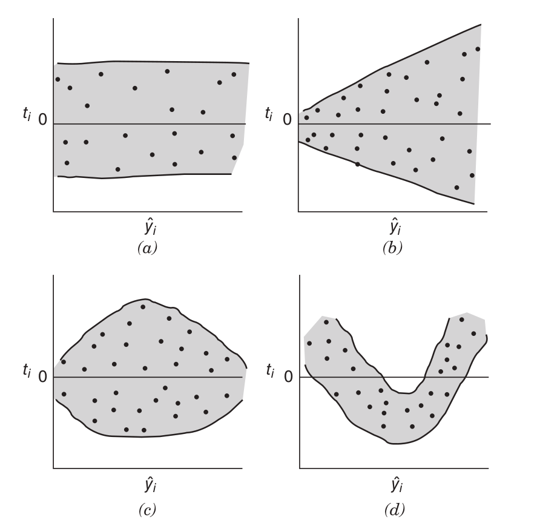
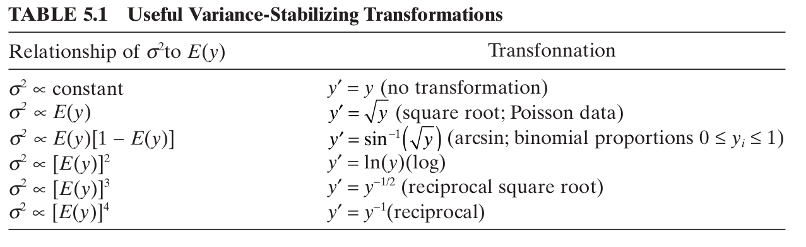
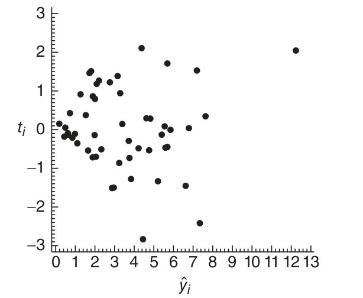
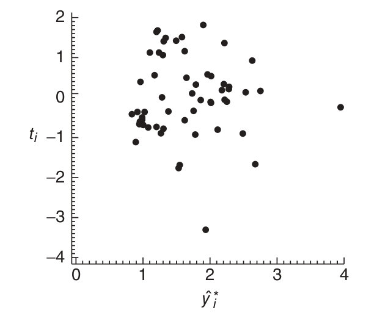

<!-- output: html_document: -->
<!--   toc: true -->
<!--   theme: united -->

<!-- output:  -->
<!--   revealjs::revealjs_presentation: -->
<!--     center: false -->


<!-- <link href="../styles.css" rel="stylesheet"> -->

## Multiple Linear Regression

Everything we've done so far rested on these assumptions:

- linear relationship between $y$ and $x$ (i.e. $y =\mathbf{x}^{\intercal}\boldsymbol{\beta} + \epsilon$)

- $\epsilon_1, \ldots, \epsilon_n \overset{iid}{\sim} \text{Normal}(0, \sigma^2)$


## Residuals!

The residuals are our friend:

$$
\mathbf{e} = \mathbf{y} - \hat{\mathbf{y}} = [\mathbf{I}- \mathbf{H} ]\mathbf{y} 
$$

## Residuals v1.0

Sometimes we look at the *standardized residuals* $d_i$

$$
d_i = \frac{e_i}{\sqrt{MS_{Res}}}
$$

Idea: make $V[d_i] \approx 1$

Why?
$$
V[e_i] \approx \sigma^2 \approx MS_{Res}
$$

## Residuals v2.0

We can do better:

mean
$$
E[\mathbf{e}] = [\mathbf{I}- \mathbf{H} ]E[\mathbf{y} ]= [\mathbf{I}- \mathbf{H} ]\mathbf{X}\boldsymbol{\beta} = \mathbf{0}
$$

covariance matrix
$$
V[\mathbf{e}] = V[(\mathbf{I} - \mathbf{H})\mathbf{y}] = \sigma^2  (\mathbf{I} - \mathbf{H})(\mathbf{I} - \mathbf{H})^{\intercal} = \sigma^2 (\mathbf{I} - \mathbf{H})
$$

- $V[e_i] = \sigma^2(1 - h_{ii})$

- $\text{Cov}( e_i, e_j) = -\sigma^2h_{i,j}$

- $V[\mathbf{e}]$ is not full rank!

## Residuals v2.0

Because 
$$
e_i \sim \text{Normal}\left(0, \sigma^2(1 - h_{ii}) \right)
$$

it's better to look at the *(internally) studentized residuals*
$$
r_i = \frac{e_i}{\sqrt{ MS_{Res} (1 - h_{ii}) }} \overset{\text{approx.}}{\sim} t_{df_{Res}}
$$

...still correlated, [not exactly $t$-distributed](https://stats.stackexchange.com/questions/396190/do-studentized-residuals-follow-t-distribution/410385#410385), not exactly unit variance

## Residuals v3.0

The *externally studentized residuals* follow a t-distribution *exactly* (if $\boldsymbol{\epsilon}$ is normal). These are what we will use to check diagnostics.

$$
t_i = \frac{e_i}{\sqrt{ MS_{(i),Res} (1 - h_{ii}) }} \sim t_{df_{Res}}
$$

$MS_{(i),Res}$ differs from $MS_{Res}$ because it is based on all of the data except for the $i$th data point. 

<!-- That is -->
<!-- $$ -->
<!-- MS_{(i),Res} = \frac{\mathbf{e}_{(i)}^{\intercal}\mathbf{e}_{(i)}}{df_{Res}-1} -->
<!-- $$ -->

## using `R`

```{r hide_this, echo=FALSE}
path_string <- "/home/t/UVa/all_teaching/summer19_6021/data/data-table-B5.csv"
my_data <- read.csv(path_string)
```


```{r residuals1, echo=T, out.height="350px", out.width="900px"}
# install.packages("MASS")
library(MASS)
mod <- lm(y ~ ., data = my_data)
stdized_resids <- residuals(mod)/sqrt(anova(mod)$'Mean Sq'[3])
intern_s_resids <- stdres(mod)
extern_s_resids <- studres(mod)
par(mfrow=c(1,3))
hist(stdized_resids)
hist(intern_s_resids)
hist(extern_s_resids)
par(mfrow=c(1,1))
```

## using `R`

internally versus externally...
```{r residuals2, echo=T, out.width="600px"}
# install.packages("MASS")
intern_s_resids <- stdres(mod)
extern_s_resids <- studres(mod)
hist(intern_s_resids - extern_s_resids)
```


<!-- talk about leverage ? -->

## Checking normality

If $\boldsymbol{\epsilon}$ is normal, then $\{t_i\}$ are iid $t_{df_{Res}}$

```{r residuals3, echo=T, out.width="600px"}
x_grid <- seq(min(extern_s_resids)-.5, max(extern_s_resids)+.5, by = .01)
dfRes <- nrow(my_data) - 7 - 1 # 7 predictors and one intercept
hist(extern_s_resids, probability = T, ylim = c(0,.5))
t_densities <- dt(x_grid, dfRes)
points(x_grid, t_densities, type = "l", col = "red")
```

## Checking 

Always plot $t_i$ versus $\hat{y}_i$ to check for heteroskedasticity and nonlinearities

```{r, echo=F, out.width="500px"}

```


## Checking 

Our model's plot:
```{r resids4, echo=T}
plot(fitted.values(mod), extern_s_resids)
```


## Missing predictors?

Another example:

```{r, echo=F}
x <- seq(-10,10,1)
my_df <- data.frame(y = (3 + 2*x - 5*x^2) + rnorm(length(x), sd = 30), x = x)
my_df$xsquared <- x^2
```

```{r bad_mod, echo=T, out.width="500px"}
bad_mod <- lm(y ~ x, data = my_df)
plot(my_df$x,my_df$y, xlab = "x", ylab = "y")
points(my_df$x, fitted.values(bad_mod), type ="l", col= "red")
plot(fitted.values(bad_mod), studres(bad_mod))
```

## Variance-Stabilizing Transformations

Sometimes you can't just add predictors until the problems go away. Sometimes you have to transform your $y$ variable

```{r, echo=F}

```


## Variance-Stabilizing Transformations


Example: 

$Y \sim \text{Poisson}\left(\lambda_x\right)$, then $E[Y] = V[Y] = \lambda_x$ (violation of linear model assumptions!)

Solution: run a regression using $\tilde{Y} = \sqrt{Y}$
$$
V[\sqrt{Y}] \approx \left\{\frac{1}{2} E[Y]^{-1/2}\right\}^2 E[Y] = \frac{1}{4}
$$

now the variance doesn't depend on the mean!

## Variance-Stabilizing Transformations

Why though?

It's because of something called the *Delta Method*, which is a way to approximate first and second moments of transformed random variables.

If $W$ has $E[W]$ and $V[W]$, and $g$ is some transformation, under certain regularlity conditions

$$
V[g(W)] \approx \{g'(E[W])\}^2 V[W]
$$


## Example

You just ran a regression, and go to check your residuals, and you see this:

```{r, echo=F}

```

peak-hour energy demand (y) versus total monthly energy usage (x)


## Example (continued)

After a square root transformation
```{r, echo=F}

```

## The Box-Cox procedure

Q: how do I choose a power on my own for the response variable $y^{\lambda}$?


A: Make it a parameter of the model!

Maybe this:

$$
y^{\lambda} = \mathbf{x}_i^{\intercal}\boldsymbol{\beta} + \epsilon
$$

## The Box-Cox procedure

Q: what do we do about really small values of $\lambda$ for $y^{\lambda}$?

Maybe this?
$$
\frac{y^{\lambda}}{\lambda} = \mathbf{x}_i^{\intercal}\boldsymbol{\beta} + \epsilon
$$

## The Box-Cox procedure

Or maybe this:
$$
\frac{y^{\lambda}-1}{\lambda} = \mathbf{x}_i^{\intercal}\boldsymbol{\beta} + \epsilon
$$

Notice that 
$$
\lim_{\lambda \to 0}\frac{y^{\lambda}-1}{\lambda} = \lim_{\lambda \to 0}\frac{\exp[\lambda \log y]-1}{\lambda} = \lim_{\lambda \to 0}\exp[\lambda \log y] \log y = \log y < \infty
$$

<!-- However the units are changing! -->

## The Box-Cox procedure

So we'll go with this:

$$
\frac{y^{\lambda}-1}{\lambda} = \beta_0 + x_1\beta_1 + \cdots x_k\beta_k + \epsilon
$$

Confusion arises because there is a difference between 
$$
f\left(\frac{y_1^{\lambda}-1}{\lambda}, \ldots, \frac{y_n^{\lambda}-1}{\lambda} \bigg\rvert \lambda, \boldsymbol{\beta}, \sigma^2\right)
$$
and

$$
f\left(y_1, \ldots, y_n \mid \lambda, \boldsymbol{\beta}, \sigma^2\right)
$$

We maximize the second one!

## The Box-Cox procedure

We have to solve these

$$
\frac{\partial \log f(y_1, \ldots, y_n \mid \lambda, \boldsymbol{\beta}, \sigma^2)}{\partial \boldsymbol{\beta}} \overset{\text{set}}{=} \mathbf{0}
$$
$$
\frac{\partial \log f(y_1, \ldots, y_n \mid \lambda, \boldsymbol{\beta}, \sigma^2)}{\partial \sigma^2} \overset{\text{set}}{=} 0
$$

$$
\frac{\partial \log f(y_1, \ldots, y_n \mid \lambda, \boldsymbol{\beta}, \sigma^2)}{\partial \lambda} \overset{\text{set}}{=} 0
$$

Solving the first two and then plugging them in gives the *profile log-likelihood* $\ell(\lambda)$. That's maximized last.

<!-- We use this: -->
<!-- $$ -->
<!-- y^{(\lambda)} =  -->
<!-- \begin{cases} -->
<!-- \frac{y^{\lambda}-1}{\lambda \dot{y}^{\lambda-1} } & \lambda \neq 0 \\ -->
<!-- \dot{y} \log(y) & \lambda = 0 -->
<!-- \end{cases} -->
<!-- $$ -->


## The Box-Cox procedure

The *profile log-likelihood* is easy to get in `R`

```{r profile_ll, echo=T, out.width="700px"}
library(MASS)
bc_res <- boxcox(y ~ ., data = my_data) # looks like lm()
```

## The Box-Cox procedure

```{r boxcox, echo=T, out.width="700px"}
best_lambda <- bc_res$x[bc_res$y == max(bc_res$y)] # or manually choose one in the range
cat(best_lambda)
my_data$transformed_y <- (my_data$y^best_lambda - 1)/best_lambda
head(my_data)
final_mod <- lm(transformed_y ~ . - y, data = my_data)  # the minus sign means "except for"
```


<!-- We use this: -->
<!-- $$ -->
<!-- y^{(\lambda)} =  -->
<!-- \begin{cases} -->
<!-- \frac{y^{\lambda}-1}{\lambda \dot{y}^{\lambda-1} } & \lambda \neq 0 \\ -->
<!-- \dot{y} \log(y) & \lambda = 0 -->
<!-- \end{cases} -->
<!-- $$ -->


## Linearization

Alternatively, the "true" model can be written as a linear model. 

If a "subject-matter expert" tells you that the model is 

$$
y = \beta_0 e^{\beta_1 x}\epsilon
$$
then
$$
\log y = \log \beta_0 + \beta_1 x + \log \epsilon
$$

- assume $\epsilon$ is log-normally distributed
- transform $y \mapsto \log y = \tilde{y}$
- regress on original $x$
- be careful of parameter interpretations

## Linearization

Another example

$$
y = \beta_0 + \beta_1 \frac{1}{x} + \epsilon
$$

is
$$
y = \beta_0 + \beta_1 \tilde{x} + \epsilon
$$

where $\frac{1}{x} = \tilde{x}$

more examples on page 178