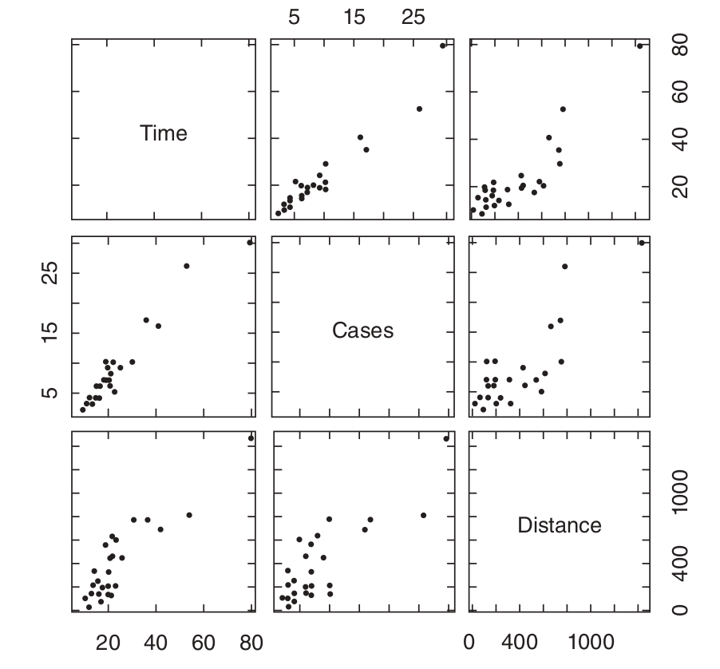
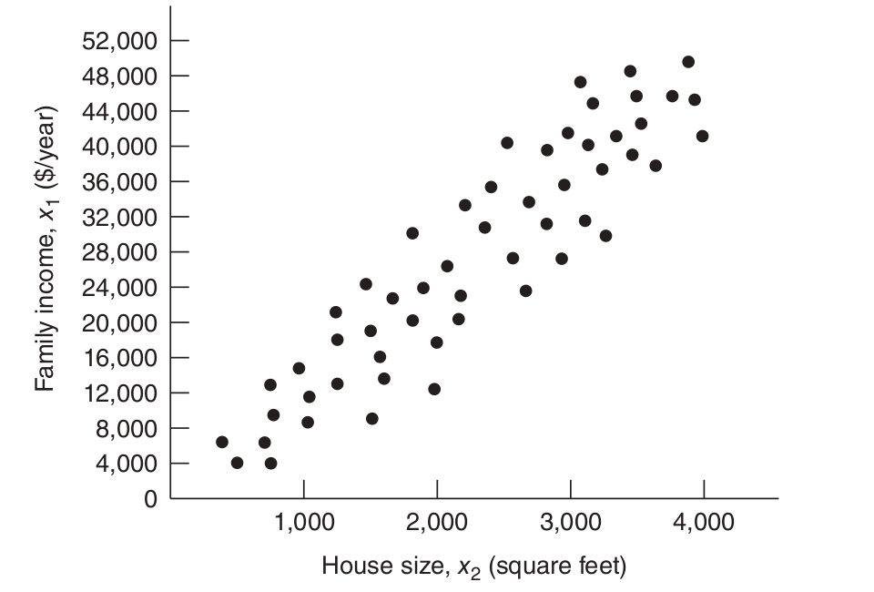

## Leverage!

When are predictions high-variance?
$$
V[\hat{\mathbf{y}}] = \sigma^2 \mathbf{H}
$$
So in particular 
$$
V[\hat{y}_i] = \sigma^2 \mathbf{H}_{ii}
$$

This has to do with "extrapoloating" (more on this later)


## Leverage!

When are predictions high-variance?
$$
V[\mathbf{e}] = \sigma^2 [\mathbf{I} - \mathbf{H}]
$$
So in particular 
$$
V[e_i] = \sigma^2(1- \mathbf{H}_{ii})
$$

high leverage points mean that we predict with full certainty (not believable!)


## Leverage

Recall 
$$
\mathbf{H} =  \mathbf{H}^2 
$$
So
$$
\mathbf{H}_{ii} =  \sum_{l \neq i} \mathbf{H}_{i,l}^2 + \mathbf{H}_{ii}^2  \ge \mathbf{H}_{ii}^2 \ge 0
$$
So 
$$
0 \le \mathbf{H}_{ii} \le 1.
$$


## Exploring $\mathbf{H}$

Recall 
$$
\mathbf{H} \mathbf{X} = \mathbf{X}.
$$

Looking at the first column 
$$
\mathbf{H} \mathbf{1} = \mathbf{1}
$$

So row-sums of the hat matrix are equal to $1$. 

## Exploring $\mathbf{H}$


We know

$$
\hat{\mathbf{y}} = \mathbf{H}\mathbf{y}
$$

and if you look at one of the rows you have 

$$
\hat{y}_j = \sum_{i=1}^n y_i \mathbf{H}_{j,i}
$$


So $\mathbf{H}_{j,i}$ is the *leverage* of obs. $i$ on fitted value $j$. 

Rule of thumb: flag row $j$ when $\mathbf{H}_{jj} > 3 \frac{k+1}{n}$. More on this in module 8!


<!-- ## Exploring $\mathbf{H}$ -->


## Exploring $\mathbf{H}$

Q: what does $\mathbf{H}_{ii}$ mean, though?

A: it's related to how far away the $i$th row/observation is from the typical observation

I.e. how far is $\mathbf{x}_i^{\intercal} = (1, x_{i1}, x_{i2}, \ldots, x_{ik})$ from $\bar{\mathbf{x}}^{\intercal}$

(Squared) Euclidean distance?

$$
[1-1]^2 + [x_{i1} - \bar{x}_{1}]^2 + \cdots [x_{ik} - \bar{x}_{k}]^2
$$

If our model has an intercept, this can be written as
$$
(\mathbf{x}_i - \bar{\mathbf{x}})^{\intercal}(\mathbf{x}_i - \bar{\mathbf{x}})
$$


## Exploring $\mathbf{H}$

How far away is the $i$th row/observation from the typical observation?

This is better

$$
\frac{[x_{i1} - \bar{x}_{1}]^2}{ s_1^2 } + \cdots + \frac{[x_{ik} - \bar{x}_{k}]^2}{s_k^2 }
$$

This can be written as
$$
(\mathbf{x}_{i,-1} - \bar{\mathbf{x}}_{-1})^{\intercal}
\begin{bmatrix}
s_1^{2} & \cdots & 0\\
\vdots & \ddots & \vdots  \\
0 & \cdots  & s_k^2
\end{bmatrix}^{-1}
(\mathbf{x}_{i,-1} - \bar{\mathbf{x}}_{-1})
$$

e.g. $s_1^2 = \sum_{i}(x_{i1} - \bar{x}_1)^2/(n-1)$


## Exploring $\mathbf{H}$

How far away is the $i$th row/observation from the typical observation?


In general we have *Mahalanobis distance*
$$
(\mathbf{x}_{i,-1} - \bar{\mathbf{x}})^{\intercal}
\mathbf{S}^{-1}
(\mathbf{x}_{i,-1} - \bar{\mathbf{x}}_{-1})
$$
where 
$$
\mathbf{S} = 
\begin{bmatrix}
s_1^{2} & \cdots & s_{1k}\\
\vdots & \ddots & \vdots  \\
s_{k1} & \cdots  & s_k^2
\end{bmatrix}
$$


## Exploring $\mathbf{H}$

How does this relate to 
$$
\mathbf{H} = \mathbf{X}(\mathbf{X}^{\intercal}\mathbf{X})^{-1}\mathbf{X}^{\intercal}
$$

$$
\mathbf{H}_{i,j} = \mathbf{X}_i^{\intercal}(\mathbf{X}^{\intercal}\mathbf{X})^{-1}\underbrace{\mathbf{X}_j}_{\text{row j}}
$$

We will show:

- $\mathbf{H}_{i,j}$ is the similarity between observations $i$ and $j$

- $\mathbf{H}_{i,i}$ is the distance of observation $i$ from the center.


## Exploring $\mathbf{H}$

They're not exactly the same. Recall 
$$
\mathbf{X}^\intercal \mathbf{X} = 
\pmatrix{n & n\bar{\mathbf{x}}_{-1}^{\intercal} \\ n\bar{\mathbf{x}}_{-1} & \mathbf{C}}
$$
where $\mathbf{C}_{jk} = \sum_{i=1}^n x_{ij} x_{ik}$. The [inverse of this block matrix](https://en.wikipedia.org/wiki/Block_matrix#Block_matrix_inversion) is

$$
\begin{bmatrix} 1/n+\bar{\mathbf{x}}_{-1}^{\intercal}( \mathbf{C}- n\bar{\mathbf{x}}_{-1}\bar{\mathbf{x}}_{-1}^{\intercal})^{-1}\bar{\mathbf{x}}_{-1}  & -\bar{\mathbf{x}}_{-1}^{\intercal}( \mathbf{C}- n\bar{\mathbf{x}}_{-1}\bar{\mathbf{x}}_{-1}^{\intercal})^{-1} \\ - ( \mathbf{C}- n\bar{\mathbf{x}}_{-1}\bar{\mathbf{x}}_{-1}^{\intercal})^{-1}\bar{\mathbf{x}}_{-1} & ( \mathbf{C}- n\bar{\mathbf{x}}_{-1}\bar{\mathbf{x}}_{-1}^{\intercal})^{-1} \end{bmatrix}
$$
which equals 
$$
\begin{bmatrix} 1/n+\bar{\mathbf{x}}_{-1}^{\intercal}( [n-1] \mathbf{S})^{-1}\bar{\mathbf{x}}_{-1}  & -\bar{\mathbf{x}}_{-1}^{\intercal}( [n-1] \mathbf{S})^{-1} \\ - ([n-1] \mathbf{S})^{-1}\bar{\mathbf{x}}_{-1} & ( [n-1] \mathbf{S})^{-1} \end{bmatrix}
$$


## Exploring $\mathbf{H}$

So

\begin{align*}
\mathbf{H}_{i,j} &= \mathbf{X}_i^{\intercal}(\mathbf{X}^{\intercal}\mathbf{X})^{-1}\mathbf{X}_j \\
&= 
\begin{bmatrix}
1 & \mathbf{x}_{i,-1}^\intercal
\end{bmatrix}
\begin{bmatrix} 1/n+\bar{\mathbf{x}}_{-1}^{\intercal}( [n-1] \mathbf{S})^{-1}\bar{\mathbf{x}}_{-1}  & -\bar{\mathbf{x}}_{-1}^{\intercal}( [n-1] \mathbf{S})^{-1} \\ - ([n-1] \mathbf{S})^{-1}\bar{\mathbf{x}}_{-1} & ( [n-1] \mathbf{S})^{-1} \end{bmatrix}
\begin{bmatrix}
1 \\
\mathbf{x}_{j,-1}
\end{bmatrix}\\
&= \begin{bmatrix}
\frac{1}{n} - (\mathbf{x}_{i,-1} - \bar{\mathbf{x}}_{-1})^{\intercal}( [n-1] \mathbf{S})^{-1}\bar{\mathbf{x}}_{-1}  & 
(\mathbf{x}_{i,-1} - \bar{\mathbf{x}}_{-1})^{\intercal}( [n-1] \mathbf{S})^{-1}
\end{bmatrix}
\begin{bmatrix}
1 \\
\mathbf{x}_{j,-1}
\end{bmatrix}\\
&= \frac{1}{n}   + (\mathbf{x}_{i,-1} - \bar{\mathbf{x}}_{-1})^{\intercal} \mathbf{S}^{-1}(\mathbf{x}_{j,-1} - \bar{\mathbf{x}}_{-1})/(n-1)
\end{align*}

In particular $\mathbf{H}_{i,i} = \frac{1}{n}   + \underbrace{(\mathbf{x}_{i,-1} - \bar{\mathbf{x}}_{-1})^{\intercal}\mathbf{S}^{-1}(\mathbf{x}_{i,-1} - \bar{\mathbf{x}}_{-1})}_{\text{Mahalanobis dist.} }/(n-1)$

<!-- ## On the variance of ${\boldsymbol{\beta}}$ -->

<!-- By the way, from a few slides back -->
<!-- $$ -->
<!-- V[{\boldsymbol{\beta}}] = \sigma^2 (\mathbf{X}^\intercal \mathbf{X})^{-1} = \sigma^2 \begin{bmatrix} 1/n+\bar{\mathbf{x}}_{-1}^{\intercal}( [n-1] \mathbf{S}^2)^{-1}\bar{\mathbf{x}}_{-1}  & -\bar{\mathbf{x}}_{-1}^{\intercal}( [n-1] \mathbf{S}^2)^{-1} \\ - ([n-1] \mathbf{S}^2)^{-1}\bar{\mathbf{x}}_{-1} & ( [n-1] \mathbf{S}^2)^{-1} \end{bmatrix} -->
<!-- $$ -->

## Multicollinearity

When you have linear dependence between your predictors, bad things can happen!

Example, trying to predict your salary next year ($y$) and using letting years spent in school ($x_1$) *and* decades spent in school ($x_2$).

Linear dependence because 
$$
x_1 - 10 \times x_2 = 0
$$

Near-linear dependence is bad, too

## Multicollinearity

Why?

Recall 
$$
\hat{\boldsymbol{\beta}} = (\mathbf{X}^\intercal \mathbf{X})^{-1}\mathbf{X}^\intercal \mathbf{y}
$$

- $(\mathbf{X}^\intercal \mathbf{X})^{-1}$ doesn't exist unless $\mathbf{X}^\intercal \mathbf{X}$ is invertible

- $\mathbf{X}^\intercal \mathbf{X}$ is invertible if and only if it's of full rank

- $\text{rank}(\mathbf{X}^\intercal \mathbf{X}) = \text{rank}(\mathbf{X})$

## Multicollinearity

`R` has your back

```{r multicollinearity_example, echo=T}
x1 <- c(1,2,3,4)
x2 <- 4*x1
y <- rnorm(n = 4)
lil_df <- data.frame(y,x1,x2)
lm(y ~ ., data=lil_df)
```


See the `NA`. It doesn't make a number up.


## Multicollinearity

Why is near-linear dependence bad?

Recall
$$
V[\hat{\boldsymbol{\beta}}] = \sigma^2(\mathbf{X}^\intercal\mathbf{X})^{-1} 
$$

Main idea: when the columns of $\mathbf{X}$ are nearly-linearly dependent, the diagonals and off-diagonals of this matrix will be high.

## Multicollinearity

For example, let's look at the variance of $\hat{\beta}_3$. So we're just interested in one of the diagonals.

Without loss of generality, let's put $\mathbf{x}_3$ in the first column of $\mathbf{X}$

$$
\mathbf{X}^\intercal \mathbf{X} = 
\begin{bmatrix}
\mathbf{x}_3^\intercal \\
\mathbf{x}_{-3}^\intercal 
\end{bmatrix}
\begin{bmatrix}
\mathbf{x}_3 & \mathbf{x}_{-3} 
\end{bmatrix}
=
\begin{bmatrix}
\mathbf{x}_3^\intercal\mathbf{x}_3 & \mathbf{x}_3^\intercal\mathbf{x}_{-3} \\
\mathbf{x}_{-3}^\intercal\mathbf{x}_3 & \mathbf{x}_{-3}^\intercal\mathbf{x}_{-3}
\end{bmatrix}
$$

Again using the (second) formula for the [inverse of a block matrix](https://en.wikipedia.org/wiki/Block_matrix#Block_matrix_inversion)
$$
V[\hat{\beta}_3] = \frac{\sigma^2}{\mathbf{x}_3^\intercal\mathbf{x}_3 - \mathbf{x}_3^\intercal\mathbf{x}_{-3} [\mathbf{x}_{-3}^\intercal\mathbf{x}_{-3}]^{-1}\mathbf{x}_{-3}^\intercal\mathbf{x}_3 }
$$

Can you recognize anything special about the denominator?

Hint: think about running an auxiliary regression of $\mathbf{x}_3$ on $\mathbf{x}_{-3}$...


## The Variance Inflation Factor (VIF)

So
\begin{align*}
V[\hat{\beta}_3] &= \frac{\sigma^2}{\mathbf{x}_3^\intercal\mathbf{x}_3 - \mathbf{x}_3^\intercal\mathbf{x}_{-3} [\mathbf{x}_{-3}^\intercal\mathbf{x}_{-3}]^{-1}\mathbf{x}_{-3}^\intercal\mathbf{x}_3 } \\
&= \frac{\sigma^2}{\mathbf{x}_3^\intercal\left[\mathbf{I} -  \mathbf{H}_{-3} \right]\mathbf{x}_3  } \\
&= \frac{\sigma^2}{SS_{T,3} - SS_{R,3}   } \\
&= \frac{\sigma^2}{SS_{T,3} }\left[\frac{1}{1 - R^2_{3} }\right]
\end{align*}

We call $\text{VIF}_3 = \frac{1}{1 - R^2_{3}}$ the *variance inflation factor* for the third coefficient. 

NB: the *co*-variances increase with the VIF, too!


## The Variance Inflation Factor (VIF)

Remember, we want to be alerted if
$$
\sum_{i=1}^p t_i \mathbf{x}_i \approx \mathbf{0}
$$
for $t_1, \ldots, t_p$ not all zero.

Looking at the correlation matrix of these $p$ variables would only alert us to pairwise correlations. 

Each VIF tells us about how a particular column relates to *all other* columns.

There is cause for concern if any VIF is higher than $10$ (or maybe even $5$).

We can also look at the determinant of $\mathbf{X}^\intercal\mathbf{X}$, too

## using `R`

Pinot Noir!

```{r vif_demo, echo=T}
library(car) #for vif()
setwd("~/UVa/all_teaching/summer19_6021/data/")
my_df <- read.csv("data-table-B11.csv")
head(my_df)
my_mod <- lm(Quality ~ Clarity + Aroma + Body + Flavor + Oakiness + Region, data = my_df)
vif(my_mod)
X <- model.matrix(my_mod)
cor(X[,-1])
pairs(X[,-1])
```


## Multicollinearity

To understand multicollinearity, we need to think about where it comes from:

- data collection method

- constraints on model or population

- model specification

- an overdefined model

Then we can decide on how to deal with it.


## Problems with the Data Collection Method

Example:

A soft drink bottler is analyzing the vending machine service routes in his distribution system. He is interested in predicting the amount of time required by the route driver to service the vending machines in an outlet. This service activity includes stocking the machine with beverage products and minor maintenance or house-keeping. The industrial engineer responsible for the study has suggested that the two most important variables affecting the delivery time ( y ) are the number of cases of product stocked ( x1 ) and the distance walked by the route driver ( x2 )

## Problems with the Data Collection Method

```{r, echo=F, out.width="500px"}

```


## Problems with Constraints on Model or Population

```{r, echo=F, out.width="500px"}

```


## Problems with Model Specification

E.g.

$$
y = \beta_0 + \beta_1 x + \beta_2 x^2 + \epsilon
$$

what if $0 < x < 1$?

## Problems arising from an Overdefined Model


E.g. 

$$
\mathbf{y} = \mathbf{X}\boldsymbol{\beta} + \boldsymbol{\epsilon}
$$


where $\mathbf{X}$ is "fat" (i.e $n < p$). 

"Dimension reduction" and "variable selection" are huge areas of research

