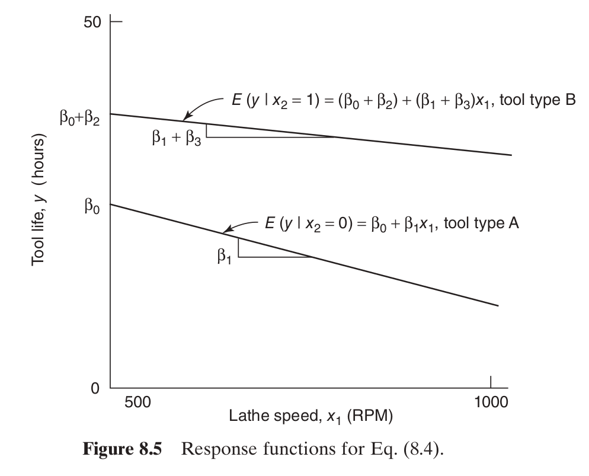

## Categorical Variables

How does regression work if we have this?

```{r, echo=F}
data("iris")
Xdf <- iris[,c(3,4,5)]
colnames(Xdf)[1] <- "y"
colnames(Xdf)[2] <- "x1"
```


```{r, echo=T}
# head(Xdf)
# table(Xdf$Species)
str(Xdf)
```
`factor` is not `string`!


## `data.frame`s are not `matrix`s [sic]


```{r, echo=T}
Xmat <- model.matrix(y ~ x1 + Species, data = Xdf)
tail(Xmat)
```

## The conversion

A `factor` column looks like strings, but they get converted to *indicator* or *dummy* variable columns.

If the `factor` column has $L$ levels, then we need $L-1$ new columns

In our case 

$$
x_{i2} = 
\begin{cases}
1 & \text{Species}_i = \text{versicolor} \\
0 & \text{else}
\end{cases}
$$

$$
x_{i3} = 
\begin{cases}
1 & \text{Species}_i = \text{virginica} \\
0 & \text{else}
\end{cases}
$$

`lm()` usally handles this for us automatically


## Back to our example

```{r, echo=T}
str(Xdf)
tail(Xmat)
```


## A simpler example

Say we have the following
$$
y = \beta_0 + \beta_1 x_1 + \beta_2 x_2 + \epsilon
$$
where $x_2$ is a dummy and $x_1$ is a "regular" quantitative variable

We can rewrite this as 
$$
y = 
\begin{cases}
\beta_0 + \beta_1 x_1 + \epsilon & x_1 = 0 \\
\beta_1 + \beta_1 x_1 + \beta_2 + \epsilon & x_2 = 1
\end{cases}
$$
This represents a *shift of the intercept*

## A simpler example

The model is still $\mathbf{y} =\mathbf{X} \boldsymbol{\beta} + \boldsymbol{\epsilon}$, where
$$
\mathbf{X} = 
\begin{bmatrix}
1 & 23 & 0 \\
\vdots & \vdots & \vdots \\
1 & 12.3 & 0 \\
1 & -68 & 1 \\
\vdots & \vdots & \vdots \\
1 & x_{11} & 1 
\end{bmatrix}
$$


## Intercept and Slope Shifts

Assume again $x_1$ is a quantitative variable and $x_2$ is a dummy variable.

This 
$$
y = \beta_0 + \beta_1x_1 + \beta_2x_2 + \beta_3 x_1 x_2 + \epsilon
$$
can be rewritten as

$$
y = 
\begin{cases}
\beta_0 + \beta_1x_1 + \epsilon & x_2 = 0\\
\beta_0 + \beta_1x_1 + \beta_2 + \beta_3 x_1  + \epsilon & x_2 = 1
\end{cases}
$$
or
$$
y = 
\begin{cases}
\beta_0 + \beta_1x_1 + \epsilon & x_2 = 0\\
(\beta_0 + \beta_2) + (\beta_1 + \beta_3) x_1 +  \epsilon & x_2 = 1
\end{cases}
$$

Interpretations?

## Slope and Intercept Shifts

```{r, echo=F, out.width = "600px"}

```

## Example 

What to do 

```{r, echo=F, out.width = "500px"}
plot(Xdf[,2], Xdf$y, col = Xdf$Species, xlab = "x1", ylab = "y")
```

## Example 

$y = \beta_0 + \beta_1x_1  + \epsilon$

```{r, echo=T, out.width = "500px"}
mod <- lm(y ~ x1 , data = Xdf)
plot(Xdf[,2], Xdf$y, col = Xdf$Species, xlab = "x1", ylab = "y")
abline(mod)
```

## Example 

$y = \beta_0 + \beta_1x_1 + \beta_2 x_2 + \beta_3 x_3 +  \epsilon$

```{r, echo=T, out.width = "500px"}
mod <- lm(y ~ x1 + Species , data = Xdf)
mod
```

```{r, echo=F, out.width="500px"}
fitted_vals <- predict(mod)
setosa_indices <- Xdf$Species == "setosa"
versicolor_indices <- Xdf$Species == "versicolor"
virginia_indices <- Xdf$Species == "virginica"
plot(Xdf[,2], Xdf$y, col = Xdf$Species, xlab = "x1", ylab = "y")
points(Xdf[setosa_indices,2], fitted_vals[setosa_indices], type = "l")
points(Xdf[versicolor_indices,2], fitted_vals[versicolor_indices], type = "l")
points(Xdf[virginia_indices,2], fitted_vals[virginia_indices], type = "l")
```


## Example 

$y = \beta_0 + \beta_1x_1 + \beta_2x_2 + \beta_3 x_3 + \beta_4 x_1 x_2 + \beta_5 x_1 x_3 + \epsilon$

```{r, echo=T, out.width = "500px"}
plot(Xdf[,2], Xdf$y, col = Xdf$Species, xlab = "x1", ylab = "y")
fitted_vals <- predict(lm(y ~ x1 + Species + x1:Species , data = Xdf))# : means interaction
setosa_indices <- Xdf$Species == "setosa"
versicolor_indices <- Xdf$Species == "versicolor"
virginia_indices <- Xdf$Species == "virginica"
points(Xdf[setosa_indices,2], fitted_vals[setosa_indices], type = "l")
points(Xdf[versicolor_indices,2], fitted_vals[versicolor_indices], type = "l")
points(Xdf[virginia_indices,2], fitted_vals[virginia_indices], type = "l")
```

## Example 

We can  use our hypothesis testing chops to test $H_0: \beta_2 = \beta_3 = \beta_4 = \beta_5 = 0$

```{r}
lil_mod <- lm(y ~ x1 , data = Xdf)
big_mod <- lm(y ~ x1 + Species + x1:Species , data = Xdf) 
anova(lil_mod, big_mod)
```

If we didn't reject that null, we could go on and test $H_0: \beta_4 = \beta_5 = 0$ (just intercept shifts) or $H_0: \beta_2 = \beta_3 = 0$ (just slope shifts)


##  Connections with Analysis of Variance

*Analysis of variance* models are examples of regression models, usually written in a slightly different way, and are useful for analyzing data from designed experiments.


##  Connections with Analysis of Variance

The *one-way fixed effects ANOVA* model is 

$$
y_{ij} = \mu + \tau_{i} + \epsilon_{ij}
$$

- $i=1, \ldots, k$ is the treatment/factor level index
- $j = 1, \ldots, n$ is the observation index (for a particular $i$)
- $\mu$ is the overall mean
- $\sum_i \tau_i = 0$ 
- "one-way" refers to there being one factor (with $k$ levels)
- index notation is reminiscent of data in a "wide" (as opposed to the "long") format


##  Connections with Analysis of Variance

Is there a difference between the groups?

The main interest is in testing the hypothesis:
$H_0 : \tau_1 = \cdots = \tau_k = 0$

Or in other words, is there anything going on?

##  Connections with Analysis of Variance

Visually:

```{r, echo=FALSE}
data(InsectSprays)
```

```{r, out.width="400px"}
str(InsectSprays)
boxplot(count ~ spray, data = InsectSprays, 
        ylab = "y", xlab = "treatment/factor level")
```


##  Connections with Analysis of Variance

Say $k=3$

$$
y_{ij} = \mu + \tau_{i} + \epsilon_{ij}.
$$
Then this is the same as
$$
y_{ij} = \beta_0 + \beta_1 \mathbf{1}(i = 2)+ \beta_2 \mathbf{1}(i = 3) + \epsilon_{ij}
$$

So

- $\mu + \tau_1 = \beta_0$
- $\mu + \tau_2 = \beta_0 + \beta_1$
- $\mu + \tau_3 = \beta_0 + \beta_2$


##  Connections with Analysis of Variance

The $\sum_i \tau_i = 0$ constraint is necessary to solve this:
$$
\begin{bmatrix}
1 & 1 & 0 & 0 \\
1 & 0 & 1 & 0 \\
1 & 0 & 0 & 1 \\
0 & 1 & 1 & 1
\end{bmatrix}
\begin{bmatrix}
\mu \\
\tau_1 \\
\tau_2 \\
\tau_3
\end{bmatrix} = 
\begin{bmatrix}
\beta_0 \\
\beta_1 \\
\beta_2 \\
0
\end{bmatrix}
$$
We get

$$
\begin{bmatrix}
\mu \\
\tau_1 \\
\tau_2 \\
\tau_3
\end{bmatrix} = 
\begin{bmatrix}
1/3 & 1/3 & 1/3 & -1/3 \\
2/3 & -1/3 & -1/3 & 1/3 \\
-1/3 & 2/3 & -1/3 & 1/3 \\
-1/3 & -1/3 & 2/3 & 1/3
\end{bmatrix}
\begin{bmatrix}
\beta_0 \\
\beta_1 \\
\beta_2 \\
0
\end{bmatrix}
$$

## using `R`

The $F_0$ statistics are the same either way you do it 

```{r, echo=T}
summary(lm(count ~ spray, data = InsectSprays))
summary(aov(count ~ spray, data = InsectSprays))
```

