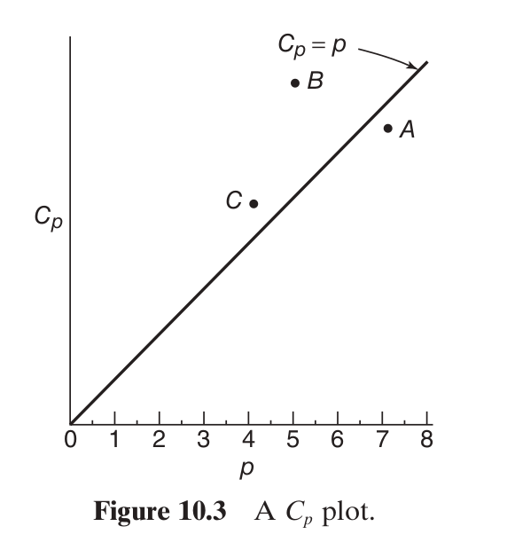

## Motivation 

Now we talk about *variable selection* which is like *model selection* as long as we're restricting ourselves to regression models.

So far we've assumed we more-or-less know which predictors we'll use.

We fit the full model, do an overall F test, maybe run one or two t-tests, check the residuals, maybe transform predictors and/or $y$, and then finish off with another check of all our assumptions.

What if you have no scientific knowledge of the problem, just a `.csv` file?


## Motivation 

Q: If you have $k$ predictors, how many possible models are there?

## Motivation 

A: 

- If you know there's an intercept: $2^{k}$ 

- If you don't know about the intercept: $2^{k+1}$

- If you start making more predictors by using interactions and/or powers ...

Multicollinearity tends to be lurking close by in this type of situation. Removing variables can help with this. 

We also talked about how residuals can signify variable omissions.

## Questions you should be asking

1. Should I err on the side of a small model (underfitting), or should I aim for a model with a large number of predictors (overfitting)?

2. Is my goal parameter inference, or prediction?


## Bias and Variances and Covariances

The *bias* of an estimate $\hat{\boldsymbol{\beta}}$ for a parameter vector $\boldsymbol{\beta}$ is
$$
E[\hat{\boldsymbol{\beta}} - \boldsymbol{\beta}].
$$

The *covariance matrix* is importance as well:
$$
V[\hat{\boldsymbol{\beta}}] = E\left\{\left(\hat{\boldsymbol{\beta}} - \boldsymbol{\beta}\right)\left(\hat{\boldsymbol{\beta}} - \boldsymbol{\beta}\right)^\intercal \right\}.
$$


## Which error measure?

Q: Bias is bad, and variance is bad. But which one do you we look at?


## Mean Square Error (MSE)

A: We look at a combination: mean squared error.

\begin{align*}
MSE(\hat{\boldsymbol{\beta}}_p) &= E[(\hat{\boldsymbol{\beta}}_p - \boldsymbol{\beta}_p)(\hat{\boldsymbol{\beta}}_p - \boldsymbol{\beta}_p)^\intercal] \tag{defn.}\\
&= E[(\hat{\boldsymbol{\beta}}_p \pm E[\hat{\boldsymbol{\beta}}_p] - \boldsymbol{\beta}_p)(\hat{\boldsymbol{\beta}}_p \pm E[\hat{\boldsymbol{\beta}}_p] - \boldsymbol{\beta}_p)^\intercal] \\
&= E[(\hat{\boldsymbol{\beta}}_p - E[\hat{\boldsymbol{\beta}}_p])(\hat{\boldsymbol{\beta}}_p - E[\hat{\boldsymbol{\beta}}_p])^\intercal] \\
&\hspace{10mm} E[(E[\hat{\boldsymbol{\beta}}_p] - \beta_p)(E[\hat{\boldsymbol{\beta}}_p] - \beta_p)] \\
&\hspace{5mm} + 2E[(\hat{\boldsymbol{\beta}}_p - E[\hat{\boldsymbol{\beta}}_p])(E[\hat{\boldsymbol{\beta}}_p] - \beta_p)^\intercal] \\
&= V[\hat{\boldsymbol{\beta}}_p] + \text{Bias}[\hat{\boldsymbol{\beta}}_p]\text{Bias}[\hat{\boldsymbol{\beta}}_p]^\intercal + 0 \tag{fundamental!}
\end{align*}


## Positive Semi-Definiteness

What does it mean when we say one matrix is bigger than or equal to another?

$$
\mathbf{M}_1 \ge \mathbf{M}_2
$$


## Positive Semi-Definiteness

This

$$
\mathbf{M}_1 \ge \mathbf{M}_2
$$

is short hand for this

$$
\mathbf{M}_1 - \mathbf{M}_2 \text{ is positve semi-definite}.
$$


A matrix $\mathbf{A}$ is positive semi-definite if for all possible vectors $\mathbf{c}$ (such that not all the elements are $0$) we have
$$
\mathbf{c}^\intercal \mathbf{A} \mathbf{c} \ge 0.
$$


## Positive Semi-Definiteness

<!-- A linear combination estimator of $\hat{\boldsymbol{\beta}}_p$ has not bigger variance because $V[\hat{\boldsymbol{\beta}}^*_p] - V[\hat{\boldsymbol{\beta}}_p]$ is positive semi-definite. That means for -->

Assume for every $\mathbf{c}$ (assuming not all elements are $0$)

$$
V[\mathbf{c}^\intercal\hat{\boldsymbol{\beta}}^*_p] \ge V[\mathbf{c}^\intercal\hat{\boldsymbol{\beta}}_p]
$$
this is true iff
$$
\mathbf{c}^\intercal V[\hat{\boldsymbol{\beta}}^*_p]\mathbf{c} - \mathbf{c}^\intercal V[\hat{\boldsymbol{\beta}}_p]\mathbf{c} \ge 0
$$
iff
$$
\mathbf{c}^\intercal \left( V[\hat{\boldsymbol{\beta}}^*_p] - V[\hat{\boldsymbol{\beta}}_p] \right) \mathbf{c} \ge 0
$$

this is the definition of $V[\hat{\boldsymbol{\beta}}^*_p] - V[\hat{\boldsymbol{\beta}}_p]$ being positive semi-definite.

## Positive Semi-Definiteness

Note
\begin{align*}
\text{MSE}[\mathbf{c}^\intercal\hat{\boldsymbol{\beta}}^*_p] &= V[\mathbf{c}^\intercal\hat{\boldsymbol{\beta}}^*_p] + \left(\mathbf{c}^\intercal E\{\hat{\boldsymbol{\beta}}^*_p - \boldsymbol{\beta}_p\} \right)^2 \\
&= \mathbf{c}^\intercal V[\hat{\boldsymbol{\beta}}^*_p]\mathbf{c} + \mathbf{c}^\intercal E\{\hat{\boldsymbol{\beta}}^*_p - \boldsymbol{\beta}_p\}E\{\hat{\boldsymbol{\beta}}^*_p - \boldsymbol{\beta}_p\}^\intercal\mathbf{c} \\
&= \mathbf{c}^\intercal\text{MSE}[\hat{\boldsymbol{\beta}}^*_p]\mathbf{c}
\end{align*}

So it's all about positive semi-definiteness for MSE matrices as well.


Now back to regression models...


## Analyzing Misspecification

Let's assume the full model is 

\begin{align*}
\mathbf{y} &= \overbrace{\mathbf{X}}^{n \times K} \boldsymbol{\beta} + \boldsymbol{\epsilon}\\
&= \underbrace{\mathbf{X}_p}_{n \times p} \boldsymbol{\beta}_p + \underbrace{\mathbf{X}_r}_{n \times r} \boldsymbol{\beta}_r + \boldsymbol{\epsilon}\\
\end{align*}


and the smaller model is 
$$
\mathbf{y} = \mathbf{X}_p \boldsymbol{\beta}_p + \widetilde{\boldsymbol{\epsilon}}
$$

- $r$ is the number of *removed* columns
- $k = p-1 = K-r$ is the number of predictors left in the smaller model
- both noise vectors have the same covariance matrix: $\sigma^2 \mathbf{I}$


## Analyzing Misspecification

Estimates for the full model

- $\hat{\boldsymbol{\beta}}^* = (\mathbf{X}^\intercal\mathbf{X})^{-1} \mathbf{X}^\intercal \mathbf{y}$

Estimates for the small model

- $\hat{\boldsymbol{\beta}}_p = (\mathbf{X}_p^\intercal\mathbf{X}_p)^{-1} \mathbf{X}_p^\intercal \mathbf{y}$

When we're overfitting

$$
E[\hat{\boldsymbol{\beta}}^*_p] = 
\left[(\mathbf{X}^\intercal\mathbf{X})^{-1} \mathbf{X}^\intercal\right]_p \mathbf{X}_p \boldsymbol{\beta}_p
$$
When we're underfitting

$$
E[\hat{\boldsymbol{\beta}}_p]  = \boldsymbol{\beta}_p + (\mathbf{X}_p^\intercal \mathbf{X}_p)^{-1} \mathbf{X}_p^\intercal \mathbf{X}_r \boldsymbol{\beta}_r = \boldsymbol{\beta}_p + \mathbf{A}\boldsymbol{\beta}_r 
$$

## Analyzing Misspecification

NB: $\mathbf{X}_p^\intercal \mathbf{X}_r = 0$ means removed columns are orthogonal to kept columns.


$$
\mathbf{X}^\intercal\mathbf{X} =
\begin{bmatrix}
\mathbf{X}_p^\intercal\mathbf{X}_p &\mathbf{X}_p^\intercal\mathbf{X}_r \\
\mathbf{X}_r^\intercal\mathbf{X}_p & \mathbf{X}_r^\intercal\mathbf{X}_r
\end{bmatrix}
=
\begin{bmatrix}
\mathbf{X}_p^\intercal\mathbf{X}_p &\mathbf{0} \\
\mathbf{0} & \mathbf{X}_r^\intercal\mathbf{X}_r
\end{bmatrix}
$$
which means
$$
(\mathbf{X}^\intercal\mathbf{X})^{-1} = 
\begin{bmatrix}
(\mathbf{X}_p^\intercal\mathbf{X}_p)^{-1} &\mathbf{0} \\
\mathbf{0} & (\mathbf{X}_r^\intercal\mathbf{X}_r)^{-1}
\end{bmatrix}
$$
and the two estimators are equivalent! This is a special case of the [general formula for the inverse of a block matrix that we saw earlier.](https://en.wikipedia.org/wiki/Block_matrix#Block_matrix_inversion) 


## Analyzing Misspecification

Estimates for the full model

- $\hat{\boldsymbol{\beta}}^* = (\mathbf{X}^\intercal\mathbf{X})^{-1} \mathbf{X}^\intercal \mathbf{y}$

Estimates for the small model

- $\hat{\boldsymbol{\beta}}_p = (\mathbf{X}_p^\intercal\mathbf{X}_p)^{-1} \mathbf{X}_p^\intercal \mathbf{y}$

When we're overfitting

$$
V[\hat{\boldsymbol{\beta}}^*_p] = 
\sigma^2
\left[(\mathbf{X}^\intercal\mathbf{X})^{-1}\right]_p
$$
When we're underfitting

$$
V[\hat{\boldsymbol{\beta}}_p] =
\sigma^2
(\mathbf{X}_p^\intercal\mathbf{X}_p)^{-1}
$$


## Deliberately Underfitting?

Assume the full model is true. 

Wrong, smaller model:
$$
MSE[\hat{\boldsymbol{\beta}}_p] = \sigma^2
(\mathbf{X}_p^\intercal\mathbf{X}_p)^{-1}+ \mathbf{A}\boldsymbol{\beta}_r\boldsymbol{\beta}_r^\intercal \mathbf{A}^\intercal 
$$

Right, full/bigger model:
$$
MSE[\hat{\boldsymbol{\beta}}^*_p] = \sigma^2 
\left[(\mathbf{X}^\intercal\mathbf{X})^{-1}\right]_p + 0
$$

Is it possible we can have smaller-MSE estimates with the restricted model?


## Deliberately Underfitting?

Yes!

$MSE[\hat{\boldsymbol{\beta}}^*_p] - MSE[\hat{\boldsymbol{\beta}}_p]$ is positive semi-definite if and only if
$$
V[\hat{\boldsymbol{\beta}}^*_r] - \boldsymbol{\beta}_r\boldsymbol{\beta}_r^\intercal
$$
is positive semi-definite. The [proof](https://stats.stackexchange.com/questions/411565/when-does-the-underfitted-regression-model-have-more-precise-coefficient-estimat/411701?noredirect=1#comment768988_411701) involves using the formula for inverses of block matrices.


Intuitively, we should leave out columns with coefficents that are "near" zero (relative to their standard errors).

## Overfitting/Underfitting and the Mean Response

For the full model, we predict at $\mathbf{x}^\intercal = \begin{bmatrix} \mathbf{x}_p^\intercal & \mathbf{x}_r^\intercal \end{bmatrix}$:
$$
\hat{y}^* = \mathbf{x}^\intercal (\mathbf{X}^\intercal \mathbf{X})^{-1} \mathbf{X}^\intercal\mathbf{y}
$$
For the smaller model we have
$$
\hat{y} = \mathbf{x}_p^\intercal (\mathbf{X}_p^\intercal \mathbf{X}_p)^{-1} \mathbf{X}_p^\intercal\mathbf{y}
$$

## Overfitting/Underfitting and the Mean Response

- $\hat{y}^* = \mathbf{x}^\intercal (\mathbf{X}^\intercal \mathbf{X})^{-1} \mathbf{X}^\intercal\mathbf{y}$

- $\hat{y} = \mathbf{x}_p^\intercal (\mathbf{X}_p^\intercal \mathbf{X}_p)^{-1} \mathbf{X}_p^\intercal\mathbf{y}$

If we're overfitting:
$$
E[\hat{y}^*] = \mathbf{x}^\intercal (\mathbf{X}^\intercal \mathbf{X})^{-1} \mathbf{X}^\intercal \mathbf{X}_p \boldsymbol{\beta}_p
$$
and if we're underfitting
\begin{align*}
E[\hat{y}] &= \mathbf{x}_p^\intercal (\mathbf{X}_p^\intercal \mathbf{X}_p)^{-1} \mathbf{X}_p^\intercal(\mathbf{X}_p \boldsymbol{\beta}_p + \mathbf{X}_r \boldsymbol{\beta}_r)\\
&= \mathbf{x}_p^\intercal\boldsymbol{\beta}_p + \mathbf{x}_p^\intercal \mathbf{A} \boldsymbol{\beta}_r
\end{align*}

## Overfitting/Underfitting and the Mean Response

- $\hat{y}^* = \mathbf{x}^\intercal (\mathbf{X}^\intercal \mathbf{X})^{-1} \mathbf{X}^\intercal\mathbf{y}$

- $\hat{y} = \mathbf{x}_p^\intercal (\mathbf{X}_p^\intercal \mathbf{X}_p)^{-1} \mathbf{X}_p^\intercal\mathbf{y}$

If we're overfitting:
$$
V[\hat{y}^*] = \sigma^2 \mathbf{x}^\intercal (\mathbf{X}^\intercal \mathbf{X})^{-1} \mathbf{x}
$$
and if we're underfitting
$$
V[\hat{y}] = \sigma^2 \mathbf{x}_p^\intercal (\mathbf{X}_p^\intercal \mathbf{X}_p)^{-1} \mathbf{x}_p
$$


## Decomposing MSPE

If your observations are independent, there is a similar decomposition for *mean square prediction error* (proof: add and subtract expectations)


$$
\text{MSPE}[\hat{y}]  :=
E\left(y' -  \hat{y}\right)^2  = E\left[\left(y' - E[y']\right)^2\right] + E\left[(\hat{y}- E[\hat{y}])^2\right] + \left(E[\hat{y}] - E[y']  \right)^2
$$

- the unseen data point is $y'$

- the model's prediction is $\hat{y}$

### Forecast errors is affected by all of the following

- inherent/future noise: $V[y'] = E\left[\left(y' - E[y']\right)^2\right] = \sigma^2$ 

- prediction/historical data noise: $V[\hat{y}]$

- miscalibration/bias/model-risk: $(E[\hat{y}] - E[y'])^2$


## Deliberately Underfitting?

Assume the full model is true. 

### Notation

- the unseen data point is $y'$

- the full model prediction is $\hat{y}^*$

- the reduced model prediction is $\hat{y}$

### Question

- when is it better to predict with the reduced model?

## Deliberately Underfitting

$$
\text{MSPE}[\hat{y}^*] \ge \text{MSPE}[\hat{y}]
$$
if and only if
$$
V[\hat{\boldsymbol{\beta}}^*_r] - \boldsymbol{\beta}_r\boldsymbol{\beta}_r^\intercal
$$

Same condition as before!

## Model Selection Criteria

Most (all?) model selection criteria are based on the idea of minimizing *out-of-sample* error/loss/badness.

Know the difference between the data used to estimate your model $\{y_i, \mathbf{x}_i \}_{i=1}^n$, and a future/unseen data point $y'_i, \mathbf{x}^\intercal_i$. 

Once again, the predictor data is assumed nonrandom, or if it isn't, then everything is conditoning on it.

## Mallows' Cp

If you use *Mallows' Cp* to pick a model, you are trying to pick the model with the lowest *out-of-sample mean squared prediction error*:

$$
E[(y_i' - \mathbf{x}_i^\intercal \hat{\boldsymbol{\beta}}_p )^2]
$$

### Note

- This is *very different* from in-sample mean square prediction error!

- $\hat{\boldsymbol{\beta}}_p$ is from a particular model using $\mathbf{X}_p$ and $\mathbf{y}$

- the expectation is taken with respect to everything that's random: $\{y_i\}$ and $y_i'$

## Mallows' Cp 

Some tricks you will find useful in the next slide:

For idempotent matrices $\mathbf{A}$, 
$$
\text{tr}(\mathbf{A}) = \text{rank}(\mathbf{A})
$$

Proof: use the rank factorization $\mathbf{A} = \mathbf{C} \mathbf{F}$
$$
\mathbf{A}\mathbf{A} = \mathbf{A} \implies \mathbf{C} \mathbf{F}\mathbf{C} \mathbf{F} = \mathbf{C} \mathbf{F} \implies \mathbf{F}\mathbf{C}\mathbf{F} = \mathbf{F} \implies \mathbf{F}\mathbf{C} = \mathbf{I}
$$
so 
$$
\text{tr}(\mathbf{A}) = \text{tr}(\mathbf{C} \mathbf{F}) = \text{tr}(\mathbf{F}\mathbf{C}) = \text{rank}(\mathbf{A})
$$

## Mallows' Cp 

Another trick that helps with expectations of quadratic forms

\begin{align*}
E\left[\mathbf{y}^\intercal \mathbf{A} \mathbf{y}\right] &= E\left[\text{tr}(\mathbf{y}^\intercal \mathbf{A} \mathbf{y})\right] \\
&= E\left[\text{tr}( \mathbf{A} \mathbf{y}\mathbf{y}^\intercal)\right] \\
&= \text{tr}(E\left[ \mathbf{A} \mathbf{y}\mathbf{y}^\intercal\right] ) \\
&= \text{tr}( \mathbf{A} E\left[  \mathbf{y}\mathbf{y}^\intercal\right] ) \\
&= \text{tr}( \mathbf{A} V[\mathbf{y}] + \mathbf{A}(E\left[  \mathbf{y}\right])(E\left[  \mathbf{y}\right])^\intercal )
\end{align*}


## Mallows' Cp

In-sample MSPE:
\begin{align*}
E[(y_i - \mathbf{x}_i^\intercal \hat{\boldsymbol{\beta}}_p )^2] &= 
V[y_i - \mathbf{x}_i^\intercal \hat{\boldsymbol{\beta}}_p] + \left(E[y_i - \mathbf{x}_i^\intercal \hat{\boldsymbol{\beta}}_p ] \right)^2 \\
&= V[y_i] + V[\mathbf{x}_i^\intercal \hat{\boldsymbol{\beta}}_p] - 2 \text{Cov}\left(y_i, \mathbf{x}_i^\intercal \hat{\boldsymbol{\beta}}_p \right) + \left(E[y_i - \mathbf{x}_i^\intercal \hat{\boldsymbol{\beta}}_p ] \right)^2
\end{align*}

Out-of-sample MSPE:
\begin{align*}
E[(y_i' - \mathbf{x}_i^\intercal \hat{\boldsymbol{\beta}}_p )^2] &= 
V[y_i' - \mathbf{x}_i^\intercal \hat{\boldsymbol{\beta}}_p] + \left(E[y_i' - \mathbf{x}_i^\intercal \hat{\boldsymbol{\beta}}_p ] \right)^2 \\
&= V[y_i'] + V[\mathbf{x}_i^\intercal \hat{\boldsymbol{\beta}}_p] - 2 \text{Cov}\left(y_i', \mathbf{x}_i^\intercal \hat{\boldsymbol{\beta}}_p \right) + \left(E[y_i' - \mathbf{x}_i^\intercal \hat{\boldsymbol{\beta}}_p ] \right)^2 \\
&= V[y_i'] + V[\mathbf{x}_i^\intercal \hat{\boldsymbol{\beta}}_p]  + \left(E[y_i' - \mathbf{x}_i^\intercal \hat{\boldsymbol{\beta}}_p ] \right)^2 \tag{indep.} \\
&= V[y_i] + V[\mathbf{x}_i^\intercal \hat{\boldsymbol{\beta}}_p]  + \left(E[y_i - \mathbf{x}_i^\intercal \hat{\boldsymbol{\beta}}_p ] \right)^2 \tag{identicalness.} \\
&= E[(y_i - \mathbf{x}_i^\intercal \hat{\boldsymbol{\beta}}_p )^2] + 2 \text{Cov}\left(y_i, \mathbf{x}_i^\intercal \hat{\boldsymbol{\beta}}_p \right) \tag{above.}
\end{align*}

## Mallows' Cp

So
$$
E[(y_i' - \mathbf{x}_i^\intercal \hat{\boldsymbol{\beta}}_p )^2] = E[(y_i - \mathbf{x}_i^\intercal \hat{\boldsymbol{\beta}}_p )^2] + 2 \text{Cov}\left(y_i, \mathbf{x}_i^\intercal \hat{\boldsymbol{\beta}}_p \right)
$$

which means

$$
E \left[ \frac{1}{n}\sum_{i=1}^n (y_i' - \mathbf{x}_i^\intercal \hat{\boldsymbol{\beta}}_p )^2\right] = E\left[\frac{1}{n}\sum_{i=1}^n (y_i - \mathbf{x}_i^\intercal \hat{\boldsymbol{\beta}}_p )^2\right] + 2 \frac{1}{n}\sum_{i=1}^n \text{Cov}\left(y_i, \mathbf{x}_i^\intercal \hat{\boldsymbol{\beta}}_p \right)
$$

which is the same as 

$$
E \left[ \frac{1}{n}\sum_{i=1}^n (y_i' - \mathbf{x}_i^\intercal \hat{\boldsymbol{\beta}}_p )^2\right] = E\left[\frac{1}{n}\sum_{i=1}^n (y_i - \mathbf{x}_i^\intercal \hat{\boldsymbol{\beta}}_p )^2\right] + 2 \frac{\sigma^2}{n}p
$$

because $\text{Cov}\left(y_i, \mathbf{x}_i^\intercal \hat{\boldsymbol{\beta}}_p \right) = \sigma^2 \mathbf{H}_{ii}$ and because $\text{tr}(\mathbf{H}) = p$

## Mallows' Cp

Based on
$$
E \left[ \frac{1}{n}\sum_{i=1}^n (y_i' - \mathbf{x}_i^\intercal \hat{\boldsymbol{\beta}}_p )^2\right] = \underbrace{E\left[\frac{1}{n}\sum_{i=1}^n (y_i - \mathbf{x}_i^\intercal \hat{\boldsymbol{\beta}}_p )^2\right]}_{\text{in-sample average error}} + \underbrace{ 2 \frac{\sigma^2}{n}p}_{\text{penalty}}
$$

Mallows' Cp for a particular model is
$$
C_p := \frac{1}{n}\sum_{i=1}^n (y_i - \mathbf{x}_i^\intercal \hat{\boldsymbol{\beta}}_p )^2 + 2\frac{\hat{\sigma}^2_{\text{full}}}{n}p
$$

where $\hat{\sigma}^2_{\text{full}}$ is from the largest possible model (it's unbiased assuming the true model's predictors are contained in the full model). So, *pick the model with the smallest!*

## Mallows' Cp

Alternatively, sometimes people divide through by $\hat{\sigma}^2_{\text{full}}/n$ and then subtract $n$:
$$
\frac{1}{\hat{\sigma}^2_{\text{full}}}\sum_{i=1}^n (y_i - \mathbf{x}_i^\intercal \hat{\boldsymbol{\beta}}_p )^2 + 2p - n = \frac{SS_{Res}(p) }{\hat{\sigma}^2_{\text{full}}} + 2p - n
$$

This has expectation roughly $p$, so people like to plot it versus $p$. However, the goal is still to pick the model with the smallest value (pick model $C$ in this case).

```{r, echo=FALSE, out.width="300px"}

```


## AIC

*Akaike's Information Criterion* (AIC) suggests picking the model that minimizes out of sample cross entropy (a loss different than squared error)

$$
E\left[-2 \sum_{i=1}^n \log \hat{p}(y_i') \right]
$$

Entropy is just the average "surprise" of your prediction:

- $\hat{p}( \cdot)$ is a probabilistic prediction model estimated on old data $\{y_i\}$. WLOG let's say it's a density.

- you want to plug new values $y_i'$ into the density, and high densities are better (no surprises)

- this is equivalent to the negative twice the log of the density being low

- the $y_i'$s you're plugging in are random, so you take the average 

- sometimes people *maximize* $E\left[\sum_{i=1}^n \log \hat{p}(y_i') \right]$


## AIC

For a particular model with $p$ columns in the design matrix
\begin{align*}
\text{AIC} &:= - 2 \log(L) + 2p \\
&= n  \log\left(\frac{SS_{Res}}{n} \right) + 2p
\end{align*}


where 
$$
\log L = -\frac{n}{2}\log(2\pi) - \frac{n}{2}\log(\hat{\sigma}^2 ) - \frac{1}{2 \hat{\sigma}^2}\sum_{i=1}^n \left( y_i - \mathbf{x}^\intercal \hat{\boldsymbol{\beta}}_p \right)^2 = \underbrace{-\frac{n}{2}(\log(2\pi) +1)}_{\text{often ignored}}- \frac{n}{2}\log\left(\frac{SS_{Res}}{n} \right) 
$$
is the normal density with the maximum likelihood estimates plugged in. Recall $\hat{\sigma}^2 = SS_{Res}/n$, the MLE, is different from MSE because of the denominator.

## Honorable mentions

- BIC, DIC, AICc, WAIC, etc.

- $R^2$ and adjusted $R^2$ (mentioned in module 3)

- cross validation, the PRESS statistic (coming soon!)


## using `R`

```{r, echo=FALSE}
data("mtcars")
carsdf <- mtcars[,-c(8:11)]
```

```{r, echo=T}
library(leaps)
head(carsdf)
allMods <- regsubsets(mpg ~ ., data = carsdf, nbest = 10, nvmax = NULL, method = "exhaustive")
#summary(allMods)
```


## using `R`

Pick the top row!

```{r, echo=T}
#?plot.regsubsets
plot(allMods, scale = "Cp")
```

## using `R`

```{r, echo=T}
library(car)
subsets(allMods, statistic="cp", legend = FALSE, min.size = 2, main = "Mallow Cp")
abline(a = 1, b = 1, lty = 2)
```

## using `R`

`leaps()` doesn't calculate AIC, so we have to use `bestglm()`

```{r}
library(bestglm)
## y var has to come last and be named y
carsdf.for.bestglm <- within(carsdf, 
{
    y    <- mpg         # mpg into
    mpg  <- NULL        # Delete old mpg
})
carsdf.for.bestglm <-
    carsdf.for.bestglm[, c("cyl", "disp", "hp", "drat", "wt", "qsec", "y")]
allModsWithAIC <-
    bestglm(Xy = carsdf.for.bestglm,
            family = gaussian, 
            IC = "AIC",           
            method = "exhaustive")
allModsWithAIC$BestModels
```

Picks the same model as Mallows' Cp!

## Stepwise Model Selection

Recall that the number of models grows exponentially in the number of possible predictors. 

Sometimes you'll have too many columns, and doing an exhaustive search will be computationally prohibitive.

We'll mention

- forward selection

- backward elimination

- stepwise (combination of the above)


## Forward Selection

For each absent predictor, estimate the model with this new predictor added. Add predictor with lowest p-value, only if it's below a threshold. 

- start with smallest model: $y = \beta_0 + \epsilon$

- p-values come from the $t$-test, which is the same as the partial $F$-test when the bigger model has only one more predictor.

## Forward Selection

```{r, echo=T}
library(olsrr)
fullMod <- lm(mpg ~ ., data = carsdf)
ols_step_forward_p(fullMod, penter = .3, details = T)
```

## Backward Selection

Backward selection starts with the full model, but it uses the same F tests as forward selection.

Test the current model against all submodels that have one fewer predictor. Recall that the null hypothesis is that the full model is true. If all p-values are larger than the threshold, move to the model with the highest p-value.

## Backward Selection

Backward selection picks the same model as well.

```{r, echo=T}
library(olsrr)
fullMod <- lm(mpg ~ ., data = carsdf)
ols_step_backward_p(fullMod, prem = .3, details = T)
```

## Stepwise Regression

If you use stepwise regression, you must specify two thresholds: one for entering variables into the model, and one for removing variables.

Stepwise is like forward selection with an added backward selection part. Once you've added in a variable with a forward selection part, you re-check all the variables that are currently in there. This second check is identical to what is done in the backward selection procedure.

## Stepwise Regression

```{r, echo=T}
library(olsrr)
fullMod <- lm(mpg ~ ., data = carsdf)
ols_step_both_p(fullMod, pent = .1, prem = .3, details = T)
```


## Comments

- Forward/Backward/Stepwise have no guarantees of any kind of optimality

- end of section 10.2 has some suggestions that may or may not work

- do the exhaustive search if you can, although there are no guarantees here, either.

- remember that Mallows' and AIC are very noisy

- looking at hypothesis tests after doing model selection is misleading/worthless


## Model Adequacy Checking versus Model Validation

The text distinguishes between model adequacy checking versus model validation.

*Model adequacy checking* includes residual analysis, testing for lack of fit, searching for high leverage or overly influential observations, and other internal analyses that investigate the fit of the regression model to the available data.

*Model validation*, however, is directed toward determining if the model will function successfully in its intended operating environment.

## Why Model Validation?

The data generating process may change:

- Influential factors that were unknown during the model-building stage may
significantly affect the new observations, rendering the predictions almost useless.

- The correlative structure between the regressors may differ in the
model-building and prediction data

Model user will ignore/forget the Model Developer's decisions

- start trying to interpret p-values (i.e. p-hacking)

- use for prediction when it was intended for inference, or vice versa

## How to do Model Validation?

Depends on what your intention is:

1. check the coefficients' signs/magnitudes (are VIFS > 5?)
2. check predictions (split the data, or on fresh data)

They mention cross-validation as a way to validate a model, but it is also a commonly-used model selection tool.

## Cross-Validation

Here the data is repeatedly partitioned into different training-set-test-set pairs (aka *folds*) for each model we want to evaluate.

1. The partitions are nonrandom, test sets are disjoint
2. for each split/estimation/prediction, we never use a data point twice
3. for each split/estimation/prediction, we lose parameter estimation accuracy because each training set is smaller than the full set
4. however, we get to average over many prediction scores, which reduces variance
5. there is still a bias that we have to estimate (but it's usually smaller than AIC)
6. it can be computationally brutal to calculate for some models (but it's not that bad for linear regression models!)


```{r, echo=F, out.width = "300px"}

```

## LOO Cross-Validation and the PRESS statistic

In *leave-one-out (LOO)* cross validation, each test set is of size $1$. That means there are $n$ folds.

To predict $y_i$, we use $\mathbf{X}_{(i)}$ and $\mathbf{y}_{(i)}$. Comparing the two, we get a squared prediction error: $(y_i - \hat{y}_{(i)})^2$. Then we add them up to get the *predicted residual error sum of squares (PRESS)*
$$
\text{PRESS}_p = \sum_{i=1}^n(y_i - \hat{y}_{(i)})^2.
$$

The *insanely-cool* thing about regression models is that for each model you're cross-validating, you don't need to re-fit the model on the $n$ folds!

$$
\text{PRESS}_p = \sum_{i=1}^n \left(\frac{e_i}{1 - h_{ii}} \right)^2.
$$

## PRESS proof

This is too cool not to prove:

$$
\hat{y}_{(i)} =  \mathbf{x}_i^\intercal \hat{\boldsymbol{\beta}}_{(i)} = \mathbf{x}_{i}^\intercal (\mathbf{X}_{(i)}^\intercal\mathbf{X}_{(i)})^{-1}\mathbf{X}_{(i)}^\intercal \mathbf{y}_{(i)} 
$$

The key is the [Sherman-Morrison formula](https://en.wikipedia.org/wiki/Sherman%E2%80%93Morrison_formula).
$$
(\mathbf{X}_{(i)}^\intercal\mathbf{X}_{(i)})^{-1} = \left(\mathbf{X}^\intercal \mathbf{X} - \mathbf{x}_i\mathbf{x}_i^\intercal \right)^{-1} = (\mathbf{X}^\intercal \mathbf{X})^{-1} + \frac{ (\mathbf{X}^\intercal \mathbf{X})^{-1}\mathbf{x}_i \mathbf{x}_i^\intercal(\mathbf{X}^\intercal \mathbf{X})^{-1} }{1 - \mathbf{H}_{ii}}
$$

So, because $\mathbf{X}_{(i)}\mathbf{y}_{(i)} = \mathbf{X}^\intercal\mathbf{y} - \overbrace{\mathbf{x}_i}^{\text{row i}} y_i$,
$$
\hat{\boldsymbol{\beta}}_{(i)} = \hat{\boldsymbol{\beta}} - \frac{e_i (\mathbf{X}^\intercal\mathbf{X})^{-1}\mathbf{x}_i }{1-\mathbf{H}_{ii}}
$$
leading us to get
$$
y_i - \hat{y}_{(i)} = y_i - \mathbf{x}_i^\intercal \hat{\boldsymbol{\beta}} + e_i \mathbf{x}_i^\intercal (\mathbf{X}^\intercal \mathbf{X})^{-1}\mathbf{x}_i/(1-\mathbf{H}_{ii}) =\left(\frac{e_i}{1 - \mathbf{H}_{ii} } \right)
$$
$\square$

## PRESS statistic

Minimizing $\text{PRESS}$ is equivalent to *maximizing* $R^2_{\text{pred}} = 1 - \frac{\text{PRESS}}{ SS_T }$

```{r, echo=TRUE}
library(olsrr)
fullMod <- lm(mpg ~ ., data = carsdf)
allMods <- ols_step_all_possible(fullMod)
allMods$predictors[allMods$predrsq == max(allMods$predrsq)]
```

Same model :)
