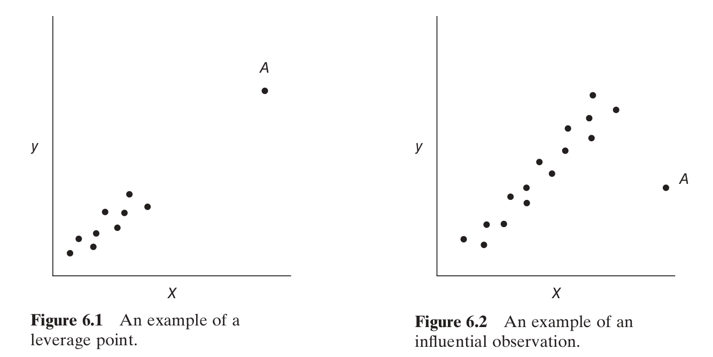

## Motivation

Recall from module 5:

$$
\hat{\mathbf{y}} = \mathbf{H}\mathbf{y}
$$

and if you look at one of the rows you have 

$$
\hat{y}_j = \sum_{i=1}^n y_i \mathbf{H}_{j,i}.
$$

The number $\mathbf{H}_{j,i}$ is the *leverage* of obs. $i$ on fitted value $j$. 

## Motivation 

In module 5 we discussed how "leverage" is related to distance form the center in $\mathbf{X}$-space:

$$
\mathbf{H}_{i,j} = \frac{1}{n}   + (\mathbf{x}_{i,-1} - \bar{\mathbf{x}}_{-1})^{\intercal}( \mathbf{S}^2)^{-1}(\mathbf{x}_{j,-1} - \bar{\mathbf{x}}_{-1}) /(n-1)
$$
where $\mathbf{S}$ is the matrix of sample variances/covariances (with $n-1$ in the denominator).

- $\mathbf{H}_{i,j}$ is the similarity between observations $i$ and $j$

- $\mathbf{H}_{i,i}$ is the distance of observation $i$ from the center.

## Definitions

In addition to leverage, we have the concept of an observation's *influence*. An observation has high influence if its existence affects the regression coefficient estimates.

```{r, echo=F, out.width="600px"}

```

## Anscombe's quartet

A good time to mention [*Anscombe's quartet*](https://www.tandfonline.com/doi/abs/10.1080/00031305.1973.10478966)

4 data sets $\{x_i, y_i\}$

- same mean
- same variances
- same correlation
- and so: same estimated regression line

but...


## Anscombe's quartet

```{r, echo=F, out.width="550px"}
knitr::include_graphics("638px-Anscombe's_quartet_3.svg.png")
```
source:Wikipedia

## Cook's D

*Cook's D* can be thought of as a measure for how a particular observation affects the overall fit/coefficient estimates/predictions.

$$
D_i := \frac{\left(\boldsymbol{\beta}_{(i)} - \boldsymbol{\beta}\right)^\intercal (\mathbf{X}^\intercal \mathbf{X}) \left(\boldsymbol{\beta}_{(i)} - \boldsymbol{\beta}\right) }{p MS_{Res} }
$$
This is clearly the same as 
$$
D_i = \frac{\left( \hat{\mathbf{y}}_{(i)} - \hat{\mathbf{y}}\right)^\intercal \left( \hat{\mathbf{y}}_{(i)} - \hat{\mathbf{y}}\right) }{p MS_{Res} }
$$

Notice the last numerator is the PRESS statistic!


## Cook's D

Finally, Cook's D can be written as

$$
D_i = \frac{r_i^2}{p} \frac{\mathbf{H}_{ii}}{1 - \mathbf{H}_{ii}}
$$
where
$$
r_i = \frac{e_i}{\sqrt{ MS_{Res} (1 - \mathbf{H}_{ii}) }} 
$$
(from in module 4). 

Key takeaway: influence is a combination of x-outliers (leverage) and y-outliers (residuals)!

## Cook's D

Proof: first, recall from module 7

$$
\hat{\boldsymbol{\beta}}_{(i)} = \hat{\boldsymbol{\beta}} - \frac{e_i (\mathbf{X}^\intercal\mathbf{X})^{-1}\mathbf{x}_i }{1-\mathbf{H}_{ii}}
$$

so
$$
\left(\boldsymbol{\beta}_{(i)} - \boldsymbol{\beta}\right)^\intercal (\mathbf{X}^\intercal \mathbf{X}) \left(\boldsymbol{\beta}_{(i)} - \boldsymbol{\beta}\right) = \frac{e_i^2 \mathbf{x}_i^\intercal(\mathbf{X}^\intercal \mathbf{X})^{-1}\mathbf{x}_i   }{(1-\mathbf{H}_{ii})^2}
$$

so
$$
D_i := \frac{\left(\boldsymbol{\beta}_{(i)} - \boldsymbol{\beta}\right)^\intercal (\mathbf{X}^\intercal \mathbf{X}) \left(\boldsymbol{\beta}_{(i)} - \boldsymbol{\beta}\right) }{p MS_{Res} } = \frac{e_i^2}{MS_{Res }(1-\mathbf{H}_{ii}) } \frac{ \mathbf{H}_{ii}   }{p (1-\mathbf{H}_{ii})} = \frac{r_i^2}{p} \frac{\mathbf{H}_{ii}}{1 - \mathbf{H}_{ii}}
$$

## Plotting Cook's D

```{r, echo=F}
data("mtcars")
carsdf <- mtcars[,-c(8:11)]
```

Cook's Distance doesn't have a nice sampling distribution (roughly $F$-distributed). Care if an observation has one above $1$.

```{r, echo=T, out.width="600px"}
fullMod <- lm(mpg ~ ., data = carsdf)
# plot(fullMod) # will allow you to cycle through afew plots interactively!
plot(fullMod, which=5)
```


## DFFITS and DFBETAS

Cook's D measures overall influence of each observation.

DFFITS and DFBETAS measure influence of each observation **on a particular coefficient, or on a particular predicted value**.

## DFBETAS

The formula for the DFBETAS of coefficient $j$ when leaving out observation $i$ is

$$
\frac{ \hat{\beta}_j - \hat{\beta}_{j(i)} }{ \sqrt{ S^2_{(i)} (\mathbf{X}^\intercal \mathbf{X})^{-1}_{jj} } }
$$

where 

- $S^2_{(i)} = \frac{\mathbf{e}_{(i)}^\intercal \mathbf{e}_{(i)}}{ n - p -1 }$

## DFBETAS

```{r, echo=T, out.width="600px"}
fullMod <- lm(mpg ~ ., data = carsdf)
dfbetas(fullMod)
library(olsrr)
ols_plot_dfbetas(fullMod) # nice plots
```

## DFFITS

The formula for the DFFITS when leaving out observation $i$ is

$$
\frac{\hat{y}_i - \hat{y}_{(i)}}{\sqrt{S^2_{(i)}\mathbf{H}_{ii} }}
$$

where 

- $\hat{y}_{(i)} = \mathbf{x}_i^\intercal \hat{\boldsymbol{\beta}}_{(i)}$

## DFFITS

```{r, echo=T}
dffits(fullMod)
ols_plot_dffits(fullMod)
carsdf[c(17,20,31),]
```


## Takeaways

Recap:

- leverage is "outlier-ness" in $x$-space
- standardized residuals measure "outlier-ness" in $y$-space
- influence is a combination of both of these (proofs and pictures)
- influence on everything: Cook's D
- influence on a particular beta: DFBETAS
- influence on a particular prediction: DFFITS
- cutoff values are rules-of-thumb and not exact hypothesis tests
